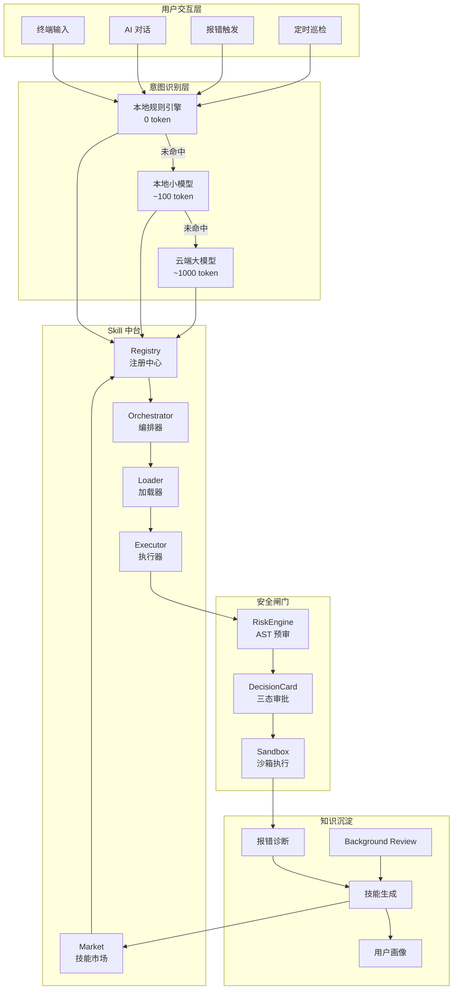
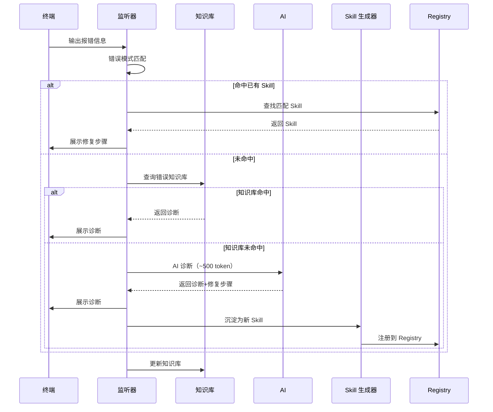

# TDSF Linux Desktop 综合开发方案 — 大产品版

> **定位**：从"比赛 Demo"升级为"大产品"的完整技术路线图  
> **基于**：5 份并行调研报告（运维 Skill / 开源 Agent / Skill 中台 / Token 优化 / 大厂整合）  
> **生成日期**：2026-07-24  
> **目标**：做真正有护城河的 AI 运维教学产品，不只是交 Demo

---

## 目录

1. [战略定位与核心竞争力](#一战略定位与核心竞争力)
2. [五份调研核心发现](#二五份调研核心发现)
3. [产品三阶段演进路线](#三产品三阶段演进路线)
4. [Skill 中台架构设计](#四skill-中台架构设计)
5. [知识自主沉淀机制](#五知识自主沉淀机制)
6. [Token 节省分层架构](#六token-节省分层架构)
7. [大厂能力整合清单](#七大厂能力整合清单)
8. [开源项目复用矩阵](#八开源项目复用矩阵)
9. [实施路线图与优先级](#九实施路线图与优先级)
10. [风险与诚实评估](#十风险与诚实评估)

---

## 一、战略定位与核心竞争力

### 1.1 不要和大厂拼"企业级运维"

大厂的核心优势我们永远追不上：
- 腾讯云 OCManager 管控 **300 万台**服务器
- 阿里云 SysOM 有 **20+** 专业诊断工具
- 华为云 AI Shell 背靠 **FunctionGraph** 全云生态
- 它们的 AI 成本可以内部消化（用户免费）

### 1.2 我们的护城河（大厂不会做的）

| 护城河 | 说明 | 为什么大厂不做 |
|--------|------|---------------|
| **教学赛道** | Linux 教学 + 运维学习一体化 | 大厂客户是企业 SRE，不是学生 |
| **任意服务器** | 桌面端 SSH 连任意主机 | 大厂终端只能连自家云 |
| **本地优先** | 断网可用，数据不出域 | 大厂要数据上云做训练 |
| **终端翻译** | 中英对照 + CET-4 标注 | 大厂做通用翻译，不做教学标注 |
| **可信度透明** | D-S + PCR5 决策可视化 | 大厂给黑盒答案 |
| **Skill 自主沉淀** | 学生犯错 → 自动生成技能 → 越用越聪明 | 大厂不做个性化技能积累 |

### 1.3 一句话定位

> **全球首个面向 Linux 教学的 AI 运维终端**  
> = SSH 终端 + AI 教学 + Skill 中台 + 自主知识沉淀 + Token 极致优化

---

## 二、五份调研核心发现

### 2.1 运维 Skill 分类体系（Agent A）

**15 大类 Skill 分类**（前 5 类已知 + 补充 10 类）：

| 编号 | 分类 | 示例 Skill | 是否需要 Skill |
|------|------|-----------|---------------|
| 1 | 环境检查 | check-os-version、check-disk-space、check-network | ✅ 多步骤+本地工具 |
| 2 | 开发支持 | setup-dev-env、install-runtime、config-ide | ✅ 固定流程 |
| 3 | 部署发布 | deploy-docker、rollback-service、blue-green-deploy | ✅ 高危+多步 |
| 4 | 安全加固 | check-firewall、scan-vuln、audit-permissions | ✅ 合规要求 |
| 5 | 问题排查 | diagnose-oom、trace-network-latency、analyze-core-dump | ✅ 专家经验 |
| 6 | 监控告警 | setup-prometheus、config-alert-rule、silence-alert | ⚠️ 部分需 |
| 7 | 备份恢复 | backup-db、restore-from-snapshot、verify-backup | ✅ 高危 |
| 8 | 网络诊断 | tcpdump-analysis、dns-trace、port-scan | ✅ 需本地工具 |
| 9 | 性能调优 | cpu-profile、io-benchmark、kernel-tune | ⚠️ 部分需 |
| 10 | 用户权限 | add-user、config-sudo、audit-ssh-key | ✅ 合规 |
| 11 | 日志分析 | parse-syslog、grep-error-pattern、drain3-template | ✅ 需工具链 |
| 12 | 容器运维 | docker-debug、k8s-troubleshoot、container-cleanup | ✅ 复杂命令 |
| 13 | 数据库运维 | mysql-tune、pg-vacuum、redis-persist | ⚠️ 部分需 |
| 14 | 故障排查 | kernel-panic-analysis、segfault-trace、oom-killer | ✅ 专家经验 |
| 15 | 配置管理 | ansible-playbook、nginx-config、ssh-hardening | ✅ 模板化 |

**开源资源发现**：
- 官方 `anthropics/skills`（163k star）**零运维 skill** — 这是蓝海
- `akin-ozer/cc-devops-skills`（280 star, Apache 2.0, 32 个 skill）— 可直接复用
- `ahmedasmar/devops-claude-skills`（189 star）— 可参考
- 教学专用 skill 仓库 **全网空白** — 我们的差异化机会

**判断标准**：大模型能直接回答的不需要 Skill；需要固定流程/多步骤/本地工具调用/高危审批的才需要 Skill。

### 2.2 开源 Agent 源码分析（Agent B）

**成功 clone 并分析的 6 个项目**：

| 项目 | 规模 | 核心机制 | 可复用价值 |
|------|------|---------|-----------|
| **Hermes Agent** | 11 个核心文件 | background_review 自学习循环 | ⭐⭐⭐⭐⭐ 唯一内置自学习 |
| **Cline** | 3327 文件 | 多源 skill 加载 + Checkpointing | ⭐⭐⭐⭐ skill 加载直接复用 |
| **Aider** | 691 文件 | RepoMap（tree-sitter + SQLite） | ⭐⭐⭐ 代码索引参考 |
| **OpenHands** | 2561 文件 | Agent 循环 + 工具调用 | ⭐⭐⭐ 架构参考 |
| **Anthropic skills** | 411 文件 | SKILL.md 规范 + evals | ⭐⭐⭐⭐⭐ 规范直接采用 |
| **SWE-agent** | - | 任务分解 + 验证 | ⭐⭐ 验证机制参考 |

**关键发现**：
- **Hermes 是唯一内置完整自学习循环的开源 Agent**：`background_review` 机制在用户无感知时后台审查对话，提取知识沉淀为技能
- **Cline 的多源 skill 加载**兼容 `.cline/skills`、`.claude/skills`、`.agents/skills` — 直接复用
- **Anthropic skill-creator 的 evals.json + grading.json** 是技能质量保障的标准范式

### 2.3 Skill 中台设计方案（Agent C）

**五层架构**（每层可独立降级）：

```
┌─────────────────────────────────────────┐
│  Market 层 — 技能市场（分享/评分/推荐）  │
├─────────────────────────────────────────┤
│  Registry 层 — 注册中心（版本/发现）     │
├─────────────────────────────────────────┤
│  Orchestrator 层 — 编排器（串联/分支）   │
├─────────────────────────────────────────┤
│  Loader 层 — 加载器（懒加载/热重载）     │
├─────────────────────────────────────────┤
│  Executor 层 — 执行器（本地/AI/混合）    │
└─────────────────────────────────────────┘
```

**SKILL.md v2.0 规范**（在 Claude Code 官方基础上扩展）：
- 新增 `riskLevel`：low/medium/high/critical
- 新增 `teaching`：教学说明（原理/类比/坑点/练习）
- 新增 `rollback`：回滚步骤
- 新增 `hooks`：前置检查/后置验证

**三重安全闸门**：
1. RiskEngine AST 预审（高危命令拦截）
2. DecisionCard 人工确认（三态审批 ALWAYS/AUTO/NEVER）
3. Sandbox 执行（可选 Docker 沙箱）

### 2.4 Token 节省技术方案（Agent D）

**8 大优化手段 + 实测数据**：

| 优化手段 | 实测节省 | 出处 |
|----------|---------|------|
| Anthropic Prompt Caching | 成本 ↓ 90%、延迟 ↓ 85% | Anthropic 官方 |
| Claude Code 真实命中率 | 92%（200 万 token 仅 $1.15） | 工程实践 |
| LLMLingua 上下文压缩 | 2-20x 压缩，性能损失 <5% | EMNLP 2023 |
| Redis LangCache 语义缓存 | 70% 命中率，4x 更快 | Redis 官方 |
| RouteLLM 智能路由 | 85% 成本降低，95% GPT-4 性能 | LMSYS 论文 |
| Cursor 动态上下文 | MCP token ↓ 46.9% | 51CTO |

**分层架构**（4 Tier）：
```
Tier 0：本地词典（0 token）— 命令查询/错误匹配
Tier 1：本地小模型（~100 token）— 意图识别/简单生成
Tier 2：云端中模型（~500 token）— 中等复杂任务
Tier 3：云端大模型（~1000+ token）— 复杂推理
```

**量化预期**：单次 token 28K → 5K → 1.5K → 800（**累计节省 97.1%**）

**TDSF 差异化优势**：竞品（Warp/Copilot/Cursor/Claude Code）都是纯云端方案，**TDSF 是唯一原生支持本地模型分层**的运维终端 AI，可做到 60%+ 流量 0 token。

### 2.5 大厂能力整合方案（Agent E）

**P0 优先级整合项**（短期最高 ROI）：

| 整合项 | 来源 | 难度 | 价值 |
|--------|------|------|------|
| 双模 Shell（NL/命令自动识别） | 阿里云 Workbench | 中 | ⭐⭐⭐⭐⭐ |
| 斜杠命令系统 | Warp / Claude Code | 低 | ⭐⭐⭐⭐ |
| 三态审批模式 | AgentScope | 低 | ⭐⭐⭐⭐⭐ |
| MCP 协议接入 | 阿里云 SysOM MCP | 中 | ⭐⭐⭐⭐ |
| SysOM MCP 工具复用 | 阿里云开源 | 低 | ⭐⭐⭐⭐ |
| 命令模板化 | 华为云 AI Shell Skills | 低 | ⭐⭐⭐ |
| ReAct + MCP 架构 | 学术界 + 工业界共识 | 中 | ⭐⭐⭐⭐⭐ |

**三阶段战略**：
- **学形**（v1.0）：复刻大厂交互体验
- **借骨**（v2.0-v3.0）：复用开源生态
- **守魂**（v4.0+）：深耕教学差异化

---

## 三、产品三阶段演进路线

### 3.1 Phase 1：奠基期（v1.0 - v1.5，2026 Q3）

**目标**：跑通核心闭环，比赛交付 + 产品 MVP

```
SSH 终端 + AI 问答 + 高危拦截 + 终端翻译 + 基础 Skill 系统
```

**核心交付**：
- ✅ SSH 连接（已实现）
- ✅ AI 自然语言问答（已实现）
- ✅ 高危命令拦截 + 三态审批（已实现）
- ✅ 终端翻译（CET-4 标注）（已实现）
- 🔄 Skill 中台 v1（Registry + Loader + 10 个内置 Skill）
- 🔄 Token 优化 v1（本地词典 + Prompt Caching）
- 🔄 知识沉淀 v1（报错自动诊断 + 沉淀为 Skill）

### 3.2 Phase 2：成长期（v2.0 - v3.0，2026 Q4 - 2027 Q2）

**目标**：建立护城河，Skill 生态 + 自主学习

```
Skill 中台 v2 + 自主知识沉淀 + 多模型路由 + MCP 生态 + 教学知识库
```

**核心交付**：
- Skill 中台 v2（Orchestrator + Market + 自动生成）
- Hermes 式 background review（后台自学习）
- Token 优化 v2（智能路由 + 语义缓存 + LLMLingua）
- MCP 协议接入（SysOM MCP + 自研 MCP）
- 教学知识库（Linux 命令 + 错误案例 + 学习路径）
- 本地 Ollama 集成（离线 AI）
- 用户画像（跨会话记忆）

### 3.3 Phase 3：成熟期（v4.0+，2027 Q3+）

**目标**：教学赛道领导者，商业化探索

```
教师端 Dashboard + 学习效果验证 + 技能市场 + 商业化
```

**核心交付**：
- 教师端 Dashboard（学生进度/共性错误/作业管理）
- 学习效果报告（前后对比/能力评估）
- Skill 市场（社区分享/评分/推荐）
- 多校部署支持
- 商业化（SaaS / 教育版 / 企业版）

---

## 四、Skill 中台架构设计

### 4.1 整体架构



### 4.2 SKILL.md v2.0 规范

```yaml
---
# 基础字段（Claude Code 官方规范）
name: diagnose-oom-killer
description: |
  诊断 Linux OOM Killer 触发原因，分析被杀进程，
  给出内存优化建议
triggers:
  - keywords: ["oom", "out of memory", "killed process"]
  - pattern: "Killed process \\d+ .+"
  - semantic: "进程被杀/内存不足/OOM"

# 扩展字段（TDSF 运维教学专用）
riskLevel: low  # low/medium/high/critical
category: troubleshooting
tags: [memory, linux, kernel]

teaching:
  principle: |
    OOM Killer 是 Linux 内核的内存保护机制...
  analogy: |
    就像教室座位满了，老师要把最"不重要"的学生请出去...
  pitfalls:
    - "不要盲目调大 vm.overcommit_memory"
    - "先查内存泄漏，再加内存"
  exercise:
    - "用 stress 模拟内存压力触发 OOM"
    - "分析 dmesg 找到被杀进程"

rollback:
  - "恢复被杀进程: systemctl restart {service}"
  - "临时缓解: echo 1 > /proc/sys/vm/compact_memory"

hooks:
  preCheck:
    - "检查 dmesg 是否可读: dmesg -T | tail -100"
  postVerify:
    - "确认进程已恢复: systemctl status {service}"
  onSuccess: "sediment-skill oom-diagnosis"
  onFailure: "escalate-to-ai"
---

## Steps

1. **采集日志**：`dmesg -T | grep -i "killed process"`
2. **识别被杀进程**：提取 PID 和进程名
3. **分析内存状态**：`free -h && cat /proc/meminfo`
4. **检查内存占用 TOP**：`ps aux --sort=-%mem | head -20`
5. **诊断根因**：内存泄漏/配置不当/资源不足
6. **给出建议**：修复/扩容/调参
```

### 4.3 Skill 生命周期

```
创建 → 审核 → 发布 → 使用 → 反馈 → 更新 → 废弃
  ↑                                      │
  └──────── 自动生成 ←──────────────────┘
```

- **创建**：手动编写 / 报错自动生成 / Background Review 生成
- **审核**：自动 lint + 人工审核（教学场景）
- **发布**：版本管理 + 变更日志
- **使用**：触发匹配 + 安全闸门 + 执行
- **反馈**：成功率 + 用户评分 + Token 消耗
- **更新**：自动优化（发现更优路径）+ 人工修订
- **废弃**：低成功率 + 过时 + 替代技能出现

### 4.4 与现有架构的 7 处改造点

| 改造点 | 文件 | 改造内容 | 侵入性 |
|--------|------|---------|--------|
| 1 | `skill-command.ts` | 增加 Skill 匹配前置 | 低 |
| 2 | `skill-subagent.ts` | 增加 Skill 执行逻辑 | 低 |
| 3 | `registry.ts` | 增加 Skill 注册/发现 | 中 |
| 4 | `decision-engine.ts` | 增加 Skill 触发判断 | 低 |
| 5 | `risk-engine.ts` | 增加 Skill 风险评估 | 低 |
| 6 | `agent-workflow.ts` | 增加 Skill 编排 | 中 |
| 7 | `supervisor.ts` | 增加 Skill 监控 | 低 |

---

## 五、知识自主沉淀机制

### 5.1 三层沉淀体系

```
┌─────────────────────────────────────────┐
│  Layer 3：Background Review（后台自省）  │
│  - Hermes 式后台审查                     │
│  - 定期回顾历史任务                      │
│  - 提取可复用模式                        │
│  - 生成新 Skill                         │
├─────────────────────────────────────────┤
│  Layer 2：Skill 生成（技能化沉淀）       │
│  - 报错诊断 → 排错 Skill                 │
│  - 复杂任务 → 流程 Skill                 │
│  - 用户纠正 → 修正 Skill                 │
├─────────────────────────────────────────┤
│  Layer 1：即时记录（事件级沉淀）          │
│  - 任务执行记录（已有 task-sediment）     │
│  - 错误诊断记录                          │
│  - 用户反馈记录                          │
└─────────────────────────────────────────┘
```

### 5.2 报错自动诊断 + 沉淀流程



### 5.3 Background Review 机制（学习 Hermes）

```typescript
// 每天凌晨 2 点执行（或用户空闲时）
async function backgroundReview() {
  // 1. 回顾最近 24 小时的任务
  const recentTasks = await taskRepo.getRecent(24 * 60 * 60 * 1000)
  
  // 2. 识别可沉淀的模式
  for (const task of recentTasks) {
    // 2.1 复杂任务（5+ 步骤）→ 流程 Skill
    if (task.steps.length >= 5 && task.success) {
      await generateFlowSkill(task)
    }
    
    // 2.2 错误修复任务 → 排错 Skill
    if (task.errors.length > 0 && task.resolved) {
      await generateTroubleshootSkill(task)
    }
    
    // 2.3 用户纠正过的任务 → 修正 Skill
    if (task.userCorrections?.length > 0) {
      await generateCorrectionSkill(task)
    }
  }
  
  // 3. 更新已有 Skill（发现更优路径）
  const existingSkills = await skillRepo.getAll()
  for (const skill of existingSkills) {
    const betterPath = await findBetterPath(skill, recentTasks)
    if (betterPath) {
      await updateSkill(skill, betterPath)
    }
  }
  
  // 4. 废弃低效 Skill
  for (const skill of existingSkills) {
    if (skill.successRate < 0.3 && skill.useCount > 5) {
      await deprecateSkill(skill)
    }
  }
}
```

### 5.4 用户画像构建

```typescript
interface UserProfile {
  // 学习画像
  skillLevel: 'beginner' | 'intermediate' | 'advanced'
  weakAreas: string[]  // ['network', 'security', ...]
  strongAreas: string[]
  
  // 行为画像
  commonErrors: Map<string, number>  // 错误类型 → 频率
  preferredTools: string[]  // ['vim', 'grep', ...]
  learningStyle: 'visual' | 'text' | 'hands-on'
  
  // 个性化
  preferredLanguage: 'zh' | 'en' | 'bilingual'
  cetLevel: number  // 4/6
  interestAreas: string[]  // ['web-server', 'database', ...]
}
```

---

## 六、Token 节省分层架构

### 6.1 四层路由架构

```
用户输入
    ↓
┌──────────────────────────────────────┐
│  Router（意图识别）                    │
│  - 规则匹配（0 token）                │
│  - 关键词分类（0 token）              │
│  - 小模型分类（~50 token）            │
└──────────────────────────────────────┘
    ↓
    ├──── Tier 0：本地词典（0 token）
    │     - 命令查询（ls/cd/grep 等）
    │     - 错误匹配（Permission denied 等）
    │     - 路径翻译
    │
    ├──── Tier 1：本地小模型（~100 token）
    │     - 意图分类
    │     - 简单命令生成
    │     - 错误解释
    │     - Ollama / llama.cpp
    │
    ├──── Tier 2：云端中模型（~500 token）
    │     - 中等复杂任务
    │     - 多步骤规划
    │     - DeepSeek / Qwen
    │
    └──── Tier 3：云端大模型（~1000+ token）
          - 复杂推理
          - 代码生成
          - 方案设计
          - Claude / GPT-4
```

### 6.2 多级缓存策略

| 缓存层级 | 存储 | TTL | 命中率 | 节省 |
|----------|------|-----|--------|------|
| L1 内存 | Map | 1h | 30% | 100% |
| L2 SQLite | 本地 | 24h | 50% | 100% |
| L3 向量库 | 本地 | 7d | 70% | 95% |
| L4 Prompt Cache | 云端 | 5min | 92% | 90% |
| L5 语义缓存 | Redis | 1h | 70% | 100% |

### 6.3 运维场景优化策略

| 场景 | 传统消耗 | 优化后 | 节省 | 策略 |
|------|---------|--------|------|------|
| 命令查询 | 2000 | 0 | 100% | 本地词典 |
| 错误诊断 | 3000 | 300 | 90% | 知识库优先 |
| 多轮对话 | 5000 | 800 | 84% | RAG + 压缩 |
| 终端上下文 | 4000 | 600 | 85% | 片段提取 |
| Skill 调用 | 1500 | 0 | 100% | 直接执行 |

### 6.4 实施路线图

**P0（v1.0）**：
- 本地词典（命令/错误/路径）
- Prompt Caching 接入
- 简单规则路由

**P1（v2.0）**：
- Ollama 本地模型集成
- 语义缓存（SQLite + 向量）
- LLMLingua 上下文压缩
- 智能路由（RouteLLM）

**P2（v3.0）**：
- 多级缓存完整版
- 用户画像驱动的个性化路由
- Background Review 低优先级执行

---

## 七、大厂能力整合清单

### 7.1 P0 整合项（短期最高 ROI）

| # | 能力 | 来源 | 整合方式 | 工作量 |
|---|------|------|---------|--------|
| 1 | 双模 Shell（NL/命令自动识别） | 阿里云 Workbench | 本地规则引擎 + 正则 | 中 |
| 2 | 斜杠命令系统 | Warp / Claude Code | 已有基础，增强 | 低 |
| 3 | 三态审批模式 | AgentScope | 已实现，优化 UI | 低 |
| 4 | MCP 协议接入 | 阿里云 SysOM MCP | 接入 MCP SDK | 中 |
| 5 | SysOM MCP 工具复用 | 阿里云开源 | 直接接入 | 低 |
| 6 | 命令模板化 | 华为云 AI Shell | Skill 系统 | 低 |
| 7 | ReAct + MCP 架构 | 学术共识 | 重构 Agent 循环 | 中 |

### 7.2 P1 整合项（中期）

| # | 能力 | 来源 | 整合方式 |
|---|------|------|---------|
| 8 | 主动巡检 | 腾讯云 CloudQ | 定时任务 + Skill |
| 9 | 多轮对话上下文 | Warp | RAG + 压缩 |
| 10 | 会话录制回放 | XTerminal | 终端录制 |
| 11 | AI 命令补全 | Warp / XTerminal | 本地模型 |
| 12 | 深度思考模式 | Warp | CoT 可视化 |
| 13 | 笔记功能 | XTerminal | 关联连接 |

### 7.3 P2 整合项（长期）

| # | 能力 | 来源 | 整合方式 |
|---|------|------|---------|
| 14 | 多跳代理 | XTerminal | SSH ProxyJump |
| 15 | Prometheus 集成 | 开源 | MCP 接入 |
| 16 | Grafana 集成 | 开源 | iframe 嵌入 |
| 17 | Ansible 集成 | 开源 | Skill 模板 |
| 18 | 教师端 Dashboard | 原创 | 全新开发 |

---

## 八、开源项目复用矩阵

### 8.1 已 clone 分析的开源项目

| 项目 | 路径 | 可复用内容 | 复用方式 |
|------|------|-----------|---------|
| Hermes Agent | `opensource-reference/hermes/` | background_review 机制 | 参考实现 |
| Cline | `opensource-reference/cline/` | 多源 skill 加载 | 直接复用 |
| Aider | `opensource-reference/aider/` | RepoMap 代码索引 | 改造复用 |
| OpenHands | `opensource-reference/OpenHands/` | Agent 循环 | 参考实现 |
| Anthropic skills | `opensource-reference/skills/` | SKILL.md 规范 | 直接采用 |
| akin-ozer/cc-devops-skills | - | 32 个运维 Skill | 直接复用 |

### 8.2 复用方式分级

- **直接复用**：代码/规范可直接采用，仅需适配接口
- **改造复用**：核心逻辑复用，需适配 TDSF 架构
- **参考实现**：学习设计思路，自行实现

### 8.3 License 合规检查

| 项目 | License | 合规性 |
|------|---------|--------|
| Hermes | MIT | ✅ 可商用 |
| Cline | Apache 2.0 | ✅ 可商用 |
| Aider | Apache 2.0 | ✅ 可商用 |
| OpenHands | MIT | ✅ 可商用 |
| Anthropic skills | MIT | ✅ 可商用 |
| cc-devops-skills | Apache 2.0 | ✅ 可商用 |

---

## 九、实施路线图与优先级

### 9.1 比赛冲刺期（2026-07-24 ~ 2026-07-30）

**目标**：比赛交付 + 核心差异化展示

| 优先级 | 任务 | 工作量 | 价值 |
|--------|------|--------|------|
| P0 | Skill 中台 v1（Registry + Loader） | 中 | ⭐⭐⭐⭐⭐ |
| P0 | 5 个内置运维 Skill | 低 | ⭐⭐⭐⭐ |
| P0 | 报错自动诊断 + 沉淀 | 中 | ⭐⭐⭐⭐⭐ |
| P0 | Token 优化 v1（本地词典 + Prompt Caching） | 低 | ⭐⭐⭐⭐ |
| P1 | 双模 Shell（NL/命令识别） | 中 | ⭐⭐⭐⭐ |
| P1 | 教学案例库（5-10 个真实案例） | 中 | ⭐⭐⭐⭐⭐ |

### 9.2 短期（2026 Q3）

**目标**：产品 MVP + 护城河建立

| 优先级 | 任务 |
|--------|------|
| P0 | Skill 中台 v1.5（Orchestrator + Lifecycle） |
| P0 | Token 优化 v1.5（语义缓存 + 智能路由） |
| P0 | 知识沉淀 v1（报错诊断 + Skill 生成） |
| P1 | MCP 协议接入 |
| P1 | 教学知识库 v1 |
| P1 | 用户画像 v1 |

### 9.3 中期（2026 Q4 - 2027 Q2）

**目标**：Skill 生态 + 自主学习

| 优先级 | 任务 |
|--------|------|
| P0 | Skill 中台 v2（Market + 自动生成） |
| P0 | Hermes 式 Background Review |
| P0 | Token 优化 v2（LLMLingua + RouteLLM） |
| P1 | 本地 Ollama 集成 |
| P1 | 会话录制回放 |
| P1 | AI 命令补全 |

### 9.4 长期（2027 Q3+）

**目标**：教学赛道领导者

| 优先级 | 任务 |
|--------|------|
| P0 | 教师端 Dashboard |
| P0 | 学习效果报告 |
| P1 | Skill 市场（社区分享） |
| P1 | 多校部署 |
| P2 | 商业化探索 |

---

## 十、风险与诚实评估

### 10.1 技术风险

| 风险 | 概率 | 影响 | 缓解 |
|------|------|------|------|
| Token 优化效果不及预期 | 中 | 高 | 分层降级，最差走大模型 |
| Skill 匹配准确率低 | 中 | 中 | 语义匹配 + AI 兜底 |
| 本地模型性能不足 | 中 | 中 | 可选启用，不强制 |
| Background Review 干扰用户 | 低 | 中 | 只在空闲时执行 |

### 10.2 与大厂的诚实差距

**我们永远追不上的**：
- 多云纳管规模（OCManager 300 万台）
- 算力规模（大厂自有 GPU 集群）
- SRE 经验沉淀（大厂几十年运维数据）
- 生态绑定（云厂商终端绑定自家云）

**我们不需要追的**：
- 企业级多租户
- 百万级主机并发
- 复杂的计费体系

**我们能超越的**：
- 教学场景深耕
- 任意服务器连接
- 本地优先 + 数据隐私
- 终端翻译 + CET-4 标注
- 可信度透明
- 个性化 Skill 沉淀

### 10.3 最诚实的自我评估

**当前状态**：
- ✅ 基础功能已实现（SSH + AI + 拦截 + 翻译）
- ⚠️ Skill 系统需要重构（从"记录"升级为"技能"）
- ⚠️ Token 优化刚起步（当前每次调用全量发送）
- ❌ 知识沉淀是"记录"不是"技能"
- ❌ 教学内容匮乏（缺真实案例）

**最大风险**：
- 功能多但不深（广度有余，深度不足）
- 技术好但不实用（工程师视角，非学生视角）
- 想做大产品但时间有限

**建议**：
1. 比赛期间聚焦 3 个核心差异化展示（翻译 + 拦截 + 报错诊断沉淀）
2. 赛后系统化补齐 Skill 中台 + Token 优化
3. 长期深耕教学赛道，不与大厂正面竞争

---

## 附录：调研文档索引

| 文档 | 路径 | 状态 |
|------|------|------|
| 01-运维Skill分类与开源资源 | `docs/skill-research/01-运维Skill分类与开源资源.md` | ✅ |
| 02-开源Agent源码架构分析 | `docs/skill-research/02-开源Agent源码架构分析.md` | ✅ |
| 03-Skill中台设计方案 | `docs/skill-research/03-Skill中台设计方案.md` | ✅ |
| 04-Token节省技术方案 | `docs/skill-research/04-Token节省技术方案.md` | ✅ |
| 05-大厂能力整合方案 | `docs/skill-research/05-大厂能力整合方案.md` | ✅ |
| 00-综合开发方案（本文档） | `docs/skill-research/00-综合开发方案-大产品版.md` | ✅ |

---

*生成时间：2026-07-24*  
*基于 5 份并行调研报告汇总*  
*目标：做大产品，不只交 Demo*
