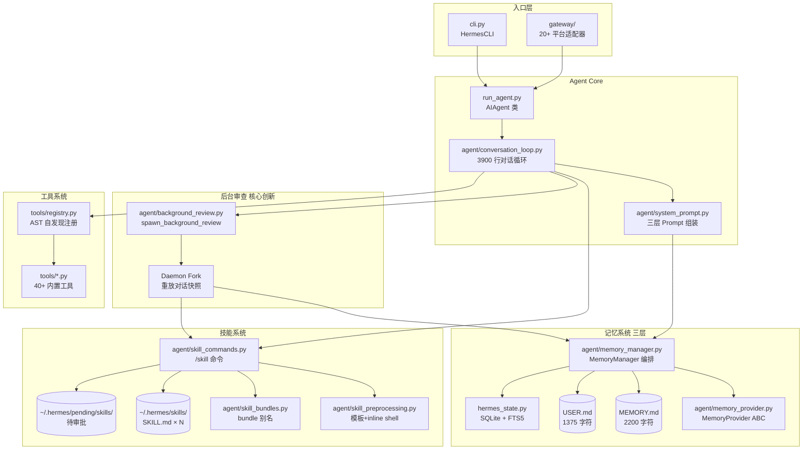
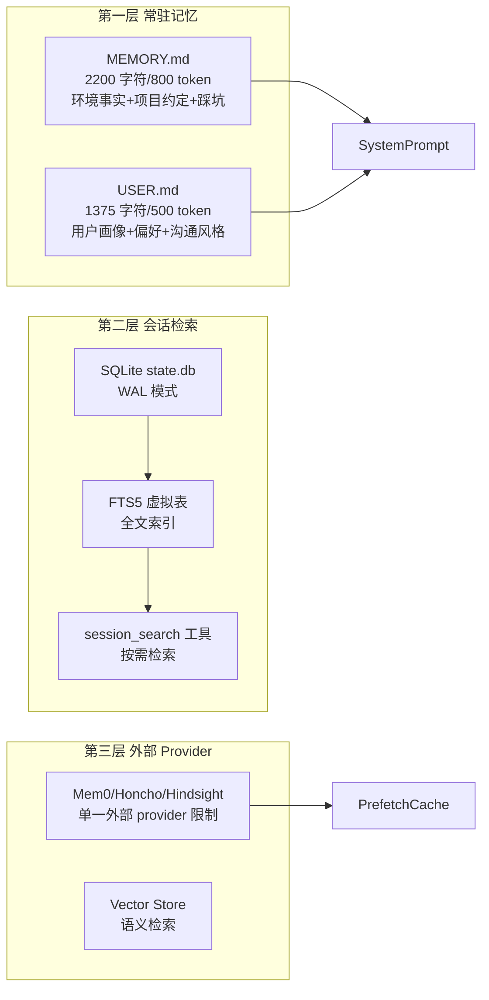
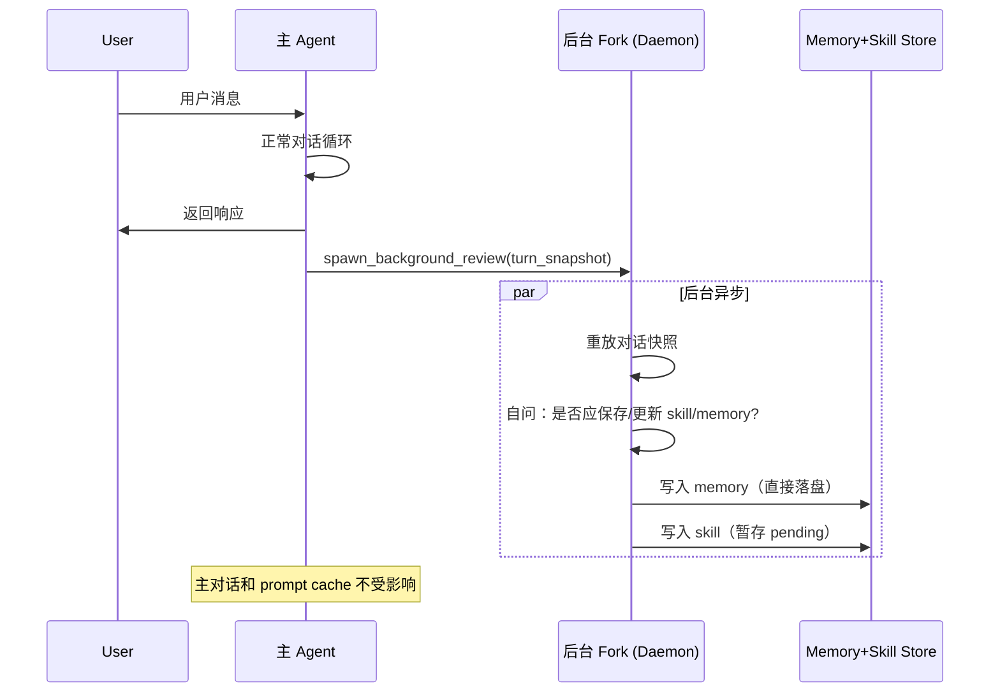
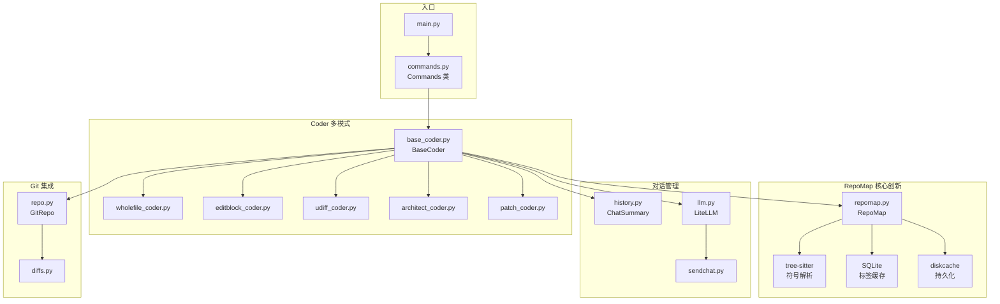
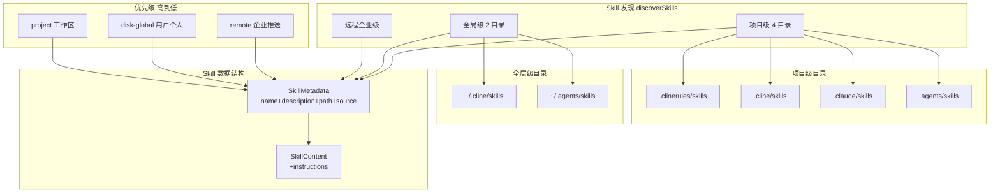
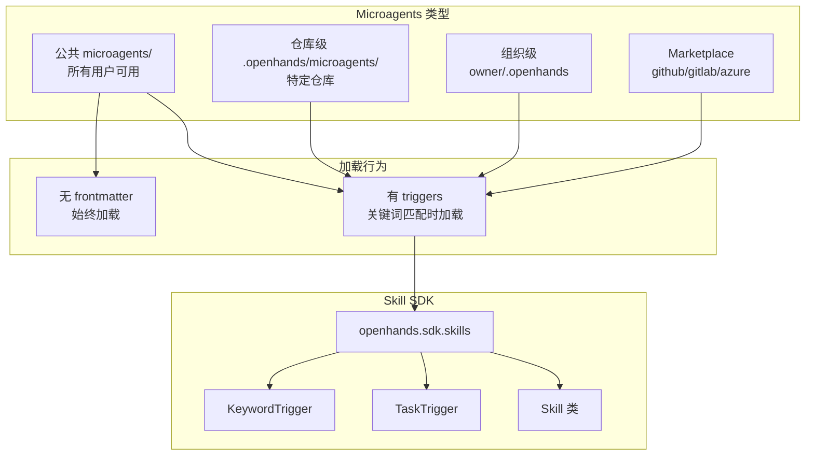
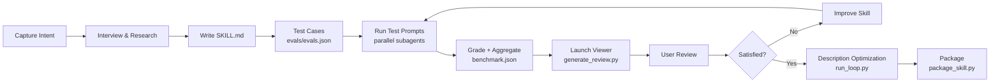
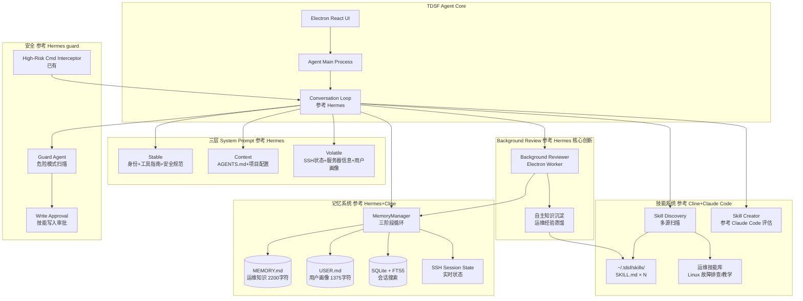

# 开源 AI Agent 源码架构深度分析

> **任务**：分析 Hermes Agent 等开源 AI Agent 的"知识沉淀为技能"与"自主记忆"机制
> **分析日期**：2026-07-24
> **分析者**：Agent 架构分析师
> **适用项目**：TDSF Linux Desktop（SSH 终端 + AI 教学运维）

---

## 0. 执行摘要

本次分析覆盖 **6 个开源 AI Agent 项目**，重点拆解其"知识沉淀 → 技能生成 → 跨会话记忆 → 后台审查"闭环。**Hermes Agent 是唯一内置完整自学习循环的开源 Agent**，其 background_review 机制是当前最具参考价值的设计。Cline 的多源 skill 加载、Aider 的 RepoMap、OpenHands 的 microagents、Claude Code 的 skill-creator 评估流程，均可在 TDSF 项目中直接复用或参考实现。

| 项目 | clone 状态 | 分析深度 | 核心机制 |
|------|-----------|---------|---------|
| **Hermes Agent** | 部分克隆（GitHub 速度受限，通过 raw URL 获取 11 个核心源文件） | ★★★★★ | background_review + 三层记忆 + 自主技能创建 |
| **Aider** | 本地完整 clone | ★★★★ | RepoMap（tree-sitter 代码符号地图） |
| **Cline** | 本地完整 clone | ★★★★ | 多源 skill 加载（兼容 cline/claude/agents 标准） |
| **OpenHands** | 本地完整 clone | ★★★★ | microagents + marketplace skills |
| **Anthropic Skills** | 本地完整 clone | ★★★★★ | SKILL.md 规范 + skill-creator 评估流程 |
| **SWE-agent** | 未 clone（通过搜索分析） | ★★ | ACI（Agent-Computer Interface） |

---

## 1. Hermes Agent 源码架构深度分析

### 1.1 项目定位与核心信息

- **仓库**：`https://github.com/NousResearch/hermes-agent`
- **开发者**：Nous Research（MIT 协议）
- **GitHub Star**：20.7 万（2026-07-02）
- **最新版本**：v0.18.0（2026-07-01）
- **核心定位**："唯一内置学习循环的 Agent"——从经验中自主创建技能、使用中自我改进、跨会话积累用户画像
- **运行形态**：CLI 终端 TUI + 消息网关（Telegram、Discord、Slack、WhatsApp、Signal、Email 六平台）

### 1.2 整体架构



### 1.3 核心文件清单（实际分析）

| 文件路径 | 行数估算 | 功能 |
|---------|---------|------|
| `run_agent.py` | ~1000+ | AIAgent 类，驱动整个对话循环 |
| `agent/conversation_loop.py` | ~3900 | 对话循环主体（model call、tool dispatch、retries、compression、post-turn hooks、background review） |
| `agent/system_prompt.py` | ~500 | System Prompt 三层组装 |
| `agent/memory_manager.py` | ~800 | MemoryManager 编排所有 memory providers |
| `agent/memory_provider.py` | ~250 | MemoryProvider 抽象基类 |
| `agent/skill_commands.py` | ~600 | 技能 slash 命令处理 |
| `agent/skill_preprocessing.py` | ~150 | SKILL.md 模板变量 + inline shell 预处理 |
| `agent/skill_bundles.py` | ~400 | 技能 bundle（一次加载多个技能） |
| `agent/background_review.py` | ~500 | 后台审查 fork 机制（核心创新） |
| `hermes_state.py` | ~1000+ | SQLite + FTS5 状态存储 |
| `tools/registry.py` | ~500 | 工具注册中心（AST 自发现） |

### 1.4 知识沉淀机制

#### 1.4.1 三层记忆架构



**关键设计决策**（源自 `agent/memory_manager.py` + `hermes_state.py`）：

1. **严格的字符上限，且不自动压缩**
   - MEMORY.md 上限 2200 字符（约 800 token）
   - USER.md 上限 1375 字符（约 500 token）
   - 写入超出时 `memory` 工具直接返回报错，不静默截断
   - Agent 必须自己合并/删除旧条目腾出空间

2. **冻结快照模式（Frozen Snapshot）**
   - 系统提示里的记忆区块只在会话开始时生成一次
   - 整个会话期间不变，即使中途修改记忆也不刷新
   - 目的：保住 LLM 的 prefix cache（系统提示变化会导致缓存失效）

3. **子串匹配的增删改**
   - `replace`/`remove` 只需提供唯一定位子串
   - 多条匹配时报错要求更精确匹配

4. **重复检测与安全扫描**
   - 拒绝完全重复的写入
   - 所有写入前扫描：提示注入特征、凭证泄露、SSH 后门、不可见 Unicode

5. **SQLite + FTS5 会话存储**（`hermes_state.py`）
   - WAL 模式：多 reader + 一个 writer（gateway 多平台并发）
   - FTS5 虚拟表：跨所有 session 消息的快速文本搜索
   - 压缩触发的 session 分割（parent_session_id 链）
   - Session source tagging（'cli', 'telegram', 'discord' 等）
   - workspace_key：git repo root 或 cwd 分组（branch 故意排除）

#### 1.4.2 MemoryProvider 抽象基类

源自 `agent/memory_provider.py`：

```python
class MemoryProvider(ABC):
    """Abstract base class for memory providers."""

    @property
    @abstractmethod
    def name(self) -> str:
        """Short identifier (e.g. 'builtin', 'honcho', 'hindsight')."""

    # -- Core lifecycle ---------------------------
    @abstractmethod
    async def initialize(self) -> None: ...
    @abstractmethod
    def system_prompt_block(self) -> str: ...
    @abstractmethod
    async def prefetch(self, query: str) -> None: ...
    @abstractmethod
    async def sync_turn(self, user_msg, assistant_response) -> None: ...
    @abstractmethod
    def get_tool_schemas(self) -> list: ...
    @abstractmethod
    def handle_tool_call(self, name, args) -> Any: ...
    @abstractmethod
    async def shutdown(self) -> None: ...

    # -- Optional hooks ---------------------------
    async def on_turn_start(self, turn, message, **kwargs): ...
    async def on_session_end(self, messages): ...
    async def on_session_switch(self, new_session_id, **kwargs): ...
    async def on_pre_compress(self, messages) -> str: ...
    async def on_memory_write(self, action, target, content, metadata=None): ...
    async def on_delegation(self, task, result, **kwargs): ...
    def backup_paths(self) -> list[str]: ...
```

**单一外部 provider 限制**：MemoryManager 强制只允许一个外部插件 provider，防止 tool schema 膨胀和冲突。

#### 1.4.3 MemoryManager 集成点

源自 `agent/memory_manager.py`：

```python
class MemoryManager:
    """Single integration point in run_agent.py."""

    def add_provider(self, plugin_provider: MemoryProvider): ...
    def build_system_prompt(self) -> str: ...
    def prefetch_all(self, user_message: str) -> Context: ...
    def sync_all(self, user_msg, assistant_response) -> None: ...
    def queue_prefetch_all(self, user_msg) -> None: ...
```

**三阶段循环**（每个 turn）：
1. **Before agent responds (prefetch)**：检查上一轮缓存的 Mem0 搜索结果，注入 system prompt（零延迟）
2. **After agent responds (sync)**：后台线程将 (user_msg, assistant_response) 发送给 provider，自动提取事实
3. **Background prefetch for next turn**：并行预加载下一轮的相关记忆

### 1.5 技能生成机制

#### 1.5.1 三层渐进式披露

源自 `agent/skill_commands.py` + `agent/skill_preprocessing.py`：

| 层级 | 调用 | 加载内容 | Token 成本 |
|------|------|---------|-----------|
| Level 0 | `skills_list()` | 仅名称/描述/分类 | 约 3k |
| Level 1 | `skill_view(name)` | 完整 SKILL.md 正文 | 按需 |
| Level 2 | 引用文件 | `references/` 下具体文档 | 按需 |

技能存放在 `~/.hermes/skills/<skill-name>/SKILL.md`。

#### 1.5.2 `/learn` 命令：从工作流蒸馏技能

```bash
# 从最近工作流学习
/learn
# 从本地目录学习
/learn ./my-project/docs
# 从 URL 学习
/learn https://example.com/guide
```

`/learn` 把任意来源蒸馏成可复用技能，自动按规范编写（描述不超过 60 字符），下次直接 `/技能名` 调用。

#### 1.5.3 自主技能创建（4 种时机）

Agent 会在以下时机自主建议创建技能：
1. 完成复杂任务（5 次以上工具调用）后
2. 从错误中恢复后
3. 被用户纠正后
4. 发现非平凡工作流后

**生产环境审批机制**（`config.yaml`）：

```yaml
skills:
  write_approval: true          # 写入先暂存 ~/.hermes/pending/skills/
  guard_agent_created: true     # 扫描危险模式
```

审批操作：
```bash
/skills pending                 # 查看待审
/skills diff <id>               # 看差异
/skills approve <id>            # 批准
/skills reject <id>             # 拒绝
```

#### 1.5.4 SKILL.md 预处理机制

源自 `agent/skill_preprocessing.py`：

```python
# 模板变量替换
${HERMES_SKILL_DIR}            # 技能目录绝对路径
${HERMES_SESSION_ID}           # 当前会话 ID

# Inline shell 展开（配置开启）
!`date +%Y-%m-%d`              # 替换为命令 stdout（4KB 上限）
!`git rev-parse --abbrev-ref HEAD`  # 当前分支
```

```yaml
# config.yaml
skills:
  template_vars: true           # 默认开启
  inline_shell: false           # 默认关闭
  inline_shell_timeout: 10      # 秒
```

#### 1.5.5 Skill Bundles（一次加载多技能）

源自 `agent/skill_bundles.py`：

```yaml
# ~/.hermes/skill-bundles/backend-dev.yaml
name: backend-dev
description: Backend feature work — code review, testing, PR workflow.
skills:
  - github-code-review
  - test-driven-development
  - github-pr-workflow
instruction: |
  Optional extra guidance to inject above the skill bodies.
```

`/backend-dev` 一次加载所有引用技能的完整内容。bundle 与 skill 同名时 bundle 胜出。

#### 1.5.6 Skills Hub 多源安装

```bash
hermes skills browse             # 浏览技能市场
hermes skills install <name>     # 安装
hermes skills tap add owner/repo # 添加自定义技能源
hermes skills audit              # 重新扫描已装技能
hermes skills check && hermes skills update
```

**支持源**：official、skills-sh、github 仓库与 tap、clawhub、claude-marketplace、browse-sh（200+ 浏览器自动化技能）

**安全扫描器**：所有安装都检查数据外泄、提示注入、破坏性命令，`--force` 也无法绕过 dangerous 级判定。

### 1.6 Background Review 机制（核心创新）

源自 `agent/background_review.py`，这是 Hermes 区别于其他 Agent 的核心设计。

#### 1.6.1 工作原理



#### 1.6.2 关键设计要点

1. **Fork 继承父进程运行时**
   - provider、model、base_url、credentials、cached system prompt
   - 命中相同 prefix cache，使用相同 auth

2. **工具白名单**
   - 只允许 memory 和 skill 管理工具
   - 其他工具在运行时被拒绝

3. **Aux 模型路由策略**
   ```yaml
   auxiliary:
     background_review:
       provider: openai       # 路由到更便宜的模型
       model: gpt-5-mini
   ```
   - 默认 "auto"：用主模型（cache 命中，便宜）
   - 不同模型：用 compact DIGEST 重放（避免冷写入）
   - 相同模型：完整重放
   - 官方数据显示成本可降低 3-5 倍

4. **不触碰主对话**
   - 写入直接到 memory + skill stores
   - 主对话和 prompt cache 不受影响

#### 1.6.3 核心代码片段

```python
# agent/background_review.py
def spawn_background_review(agent: Any, turn_snapshot: list) -> None:
    """After every turn, fork the agent to evaluate memory/skill updates.

    The fork inherits the parent's live runtime (provider, model, base_url,
    credentials, cached system prompt) so it hits the same prefix cache and
    uses the same auth. It runs with a tool whitelist limited to memory and
    skill management tools; everything else is denied at runtime.
    """
    # Resolve review runtime (auto / aux model)
    runtime = _resolve_review_runtime(agent)
    # Fork daemon thread
    threading.Thread(
        target=_run_review,
        args=(agent, turn_snapshot, runtime),
        daemon=True,
    ).start()
```

### 1.7 System Prompt 三层架构

源自 `agent/system_prompt.py`：

```python
# 三层用 \n\n 连接
def build_system_prompt(agent) -> str:
    return "\n\n".join([
        _build_stable(agent),     # stable tier
        _build_context(agent),    # context tier
        _build_volatile(agent),   # volatile tier
    ])
```

| 层级 | 内容 | 更新频率 |
|------|------|---------|
| **stable** | 身份（SOUL.md/DEFAULT_AGENT_IDENTITY）、工具指南、计算机使用、nous subscription、工具使用强制指导、技能提示、环境提示、平台提示 | Session 内永不变 |
| **context** | 调用方 system_message + 上下文文件（AGENTS.md/.cursorrules） | Session 内永不变 |
| **volatile** | 记忆快照、USER.md 用户画像、外部 memory provider 块、时间戳/session/model/provider 行 | 每 turn 可更新 |

**铁律**：System Prompt 在一个对话内字节级别稳定，保持 prefix cache 温暖。任何会导致中间重建的设计都被拒绝，节省约 70% 的 API 成本。

### 1.8 工具注册中心

源自 `tools/registry.py`：

```python
# 每个工具文件模块级别调用
registry.register(
    name="terminal_tool",
    description="...",
    parameters={...},
    handler=handle_terminal,
    toolset="shell",
    check_fn=lambda: True,  # 条件可用
)
```

**AST 自发现机制**：
- `_module_registers_tools(module_path)` 用 `ast.parse` 检查模块体是否有 `registry.register(...)` 调用
- 文本预过滤：先检查 "registry" 和 "register" 字符串是否存在
- 只检查模块体语句，不检查函数内调用

**条件可用**：例如 Home Assistant 工具只在 `HASS_TOKEN` 存在时才出现在 LLM 工具列表中，完全不占 schema 空间。

---

## 2. Aider 源码架构分析

### 2.1 项目信息

- **仓库**：`https://github.com/Aider-AI/aider`
- **定位**：AI pair programming in the terminal
- **本地路径**：`d:\ai\linux教学一体\opensource-reference\aider\`

### 2.2 核心架构



### 2.3 RepoMap 机制（核心创新）

源自 `aider/repomap.py`：

```python
class RepoMap:
    TAGS_CACHE_DIR = f".aider.tags.cache.v{CACHE_VERSION}"

    def __init__(self, map_tokens=1024, root=None, main_model=None, ...):
        self.max_map_tokens = map_tokens  # 默认 1024
        self.load_tags_cache()
        self.cache_threshold = 0.95
        self.tree_cache = {}
        self.tree_context_cache = {}
        self.map_cache = {}

    def get_repo_map(self, chat_files, other_files, ...):
        """构建代码符号地图，按重要性排序"""
        # 1. 用 tree-sitter 解析所有文件符号
        # 2. 构建符号引用图（rank 计算）
        # 3. 按 max_map_tokens 截断
        # 4. 输出 tree-sitter TreeContext 格式
```

**关键设计**：
- `Tag = namedtuple("Tag", "rel_fname fname line name kind")` - 符号元组
- tree-sitter 解析多语言符号（Python/JS/Go/Rust/Java 等 30+ 语言）
- SQLite + diskcache 双层缓存，按文件 mtime 失效
- 用 PageRank-like 算法对符号排名
- 输出 TreeContext 格式（带行号、上下文）

### 2.4 ChatSummary 对话压缩

源自 `aider/history.py`：

```python
class ChatSummary:
    def __init__(self, models=None, max_tokens=1024):
        self.models = models if isinstance(models, list) else [models]
        self.max_tokens = max_tokens
        self.token_count = self.models[0].token_count

    def summarize(self, messages, depth=0):
        """递归压缩对话历史"""
        # 1. 计算 token 总数
        # 2. 若超限，从尾部保留一半，头部压缩
        # 3. 递归直到满足限制或深度>3
```

**注意**：Aider **没有跨会话记忆**，只有会话内的对话压缩。

### 2.5 Aider 的"记忆"特点

| 机制 | 实现 | 跨会话 |
|------|------|--------|
| 代码符号地图 | RepoMap（tree-sitter + SQLite） | 是（缓存到 `.aider.tags.cache.vN`） |
| 对话压缩 | ChatSummary | 否 |
| 用户偏好 | `.aider.conf.yml` 配置文件 | 是（静态） |
| Git 历史 | GitRepo | 是（通过 git） |

---

## 3. Cline 源码架构分析

### 3.1 项目信息

- **仓库**：`https://github.com/cline/cline`
- **定位**：VS Code AI Coding Agent
- **本地路径**：`d:\ai\linux教学一体\opensource-reference\cline\`
- **架构**：Monorepo（apps/cli + apps/vscode + apps/cline-hub + sdk）

### 3.2 Skill 系统架构



### 3.3 核心文件分析

#### 3.3.1 Skill 目录扫描（`apps/vscode/src/core/storage/skill-directories.ts`）

```typescript
const SKILL_DIRECTORY_NAMES = {
    clineruleSkillsDir: ".clinerules/skills",
    clineSkillsDir: ".cline/skills",
    claudeSkillsDir: ".claude/skills",
    agentsSkillsDir: ".agents/skills",
} as const

export function getSkillsDirectoriesForScan(cwd: string): SkillsScanDirectory[] {
    return [
        { path: path.join(cwd, SKILL_DIRECTORY_NAMES.clineruleSkillsDir), source: "project" },
        { path: path.join(cwd, SKILL_DIRECTORY_NAMES.clineSkillsDir), source: "project" },
        { path: path.join(cwd, SKILL_DIRECTORY_NAMES.claudeSkillsDir), source: "project" },
        { path: path.join(cwd, SKILL_DIRECTORY_NAMES.agentsSkillsDir), source: "project" },
        { path: getClineSkillsDirectoryPath(), source: "global" },
        { path: getAgentSkillsDirectoryPath(), source: "global" },
    ]
}
```

**亮点**：兼容 4 种 skill 标准（clinerules/cline/claude/agents），实现生态互通。

#### 3.3.2 Skill 加载逻辑（`apps/vscode/src/core/context/instructions/user-instructions/skills.ts`）

```typescript
export async function discoverSkills(
    cwd: string,
    remoteSkillEntries?: GlobalInstructionsFile[]
): Promise<SkillMetadata[]> {
    const scanDirs = getSkillsDirectoriesForScan(cwd)
    const projectSkills: SkillMetadata[] = []
    const diskGlobalSkills: SkillMetadata[] = []

    for (const dir of scanDirs) {
        const dirSkills = await scanSkillsDirectory(dir.path, dir.source)
        if (dir.source === "project") {
            projectSkills.push(...dirSkills)
        } else {
            diskGlobalSkills.push(...dirSkills)
        }
    }

    // Remote skills: 验证 frontmatter.name 和 description
    const remoteSkills: SkillMetadata[] = parseRemoteSkillEntries(remoteSkillEntries || [])
        .map((entry) => ({
            name: entry.name,
            description: entry.description,
            path: `remote:${entry.name}`,
            source: "global" as const,
        }))

    // 顺序：project → disk-global → remote
    // getAvailableSkills 反向迭代，remote 最后加入最先看到，胜出
    skills.push(...projectSkills, ...diskGlobalSkills, ...remoteSkills)
    return skills
}

async function loadSkillMetadata(
    skillDir: string,
    source: "global" | "project",
    skillName: string,
): Promise<SkillMetadata | null> {
    const skillMdPath = path.join(skillDir, "SKILL.md")
    const fileContent = await fs.readFile(skillMdPath, "utf-8")
    const { data: frontmatter } = parseFrontmatter(fileContent)

    // 必填字段验证
    if (!frontmatter.name || typeof frontmatter.name !== "string") return null
    if (!frontmatter.description || typeof frontmatter.description !== "string") return null

    // name 必须匹配目录名
    if (frontmatter.name !== skillName) {
        Logger.warn(`Skill name "${frontmatter.name}" doesn't match directory "${skillName}"`)
        return null
    }

    return {
        name: skillName,
        description: frontmatter.description,
        path: skillMdPath,
        source,
    }
}
```

#### 3.3.3 Skill 接口定义（`apps/vscode/src/shared/skills.ts`）

```typescript
export interface SkillMetadata {
    name: string
    description: string
    path: string
    source: "global" | "project"
}

export interface SkillContent extends SkillMetadata {
    instructions: string
}
```

#### 3.3.4 cline skill 命令（`apps/cli/src/commands/skill.ts`）

```typescript
// `cline skill` 是 `npx skills@latest` 的薄包装
const SKILLS_PACKAGE = "skills@latest";

// 写入 skill 文件的子命令默认 scope 到 cline
const CLINE_SCOPED_SUBCOMMANDS = new Set([
    "add", "install", "i", "update", "remove", "rm", "r", "uninstall",
]);

export function buildSkillsArgs(userArgs: readonly string[]): string[] {
    const args = [...userArgs];
    const subcommand = findSubcommand(args);
    if (subcommand && CLINE_SCOPED_SUBCOMMANDS.has(subcommand) && !hasAgentFlag(args)) {
        args.push("--agent", "cline");
    }
    return ["-y", SKILLS_PACKAGE, ...args];
}
```

### 3.4 Cline 的记忆机制

Cline **没有跨会话自主记忆**，但有：
- **Checkpointing**：通过 git stash/DOW（shadow workspace）保存检查点
- **MCP 集成**：可接入外部记忆 MCP server
- **Memory Bank**（社区实践）：通过 `.clinerules/` 注入项目上下文

---

## 4. OpenHands 源码架构分析

### 4.1 项目信息

- **仓库**：`https://github.com/All-Hands-AI/OpenHands`
- **定位**：Open Source AI Software Engineer
- **本地路径**：`d:\ai\linux教学一体\opensource-reference\OpenHands\`
- **架构**：Python backend + React frontend + VSCode extension

### 4.2 Microagents 系统



### 4.3 核心文件分析

#### 4.3.1 Skill Loader（`openhands/app_server/app_conversation/skill_loader.py`）

OpenHands 采用 **thin proxy 模式**：app-server 是薄代理，真正的 skill 加载逻辑在 agent-server。

```python
class SkillInfo(BaseModel):
    """Skill information from agent-server API response."""
    name: str
    content: str
    triggers: list[str] = []
    source: str | None = None
    description: str | None = None
    is_agentskills_format: bool = False

async def fetch_skills_from_agent_server(...):
    """调用 agent-server 的 /api/skills endpoint"""
    response = await httpx_client.post(
        f"{agent_server_url}/api/skills",
        json=payload,
        headers=headers,
        timeout=30.0,
    )
```

#### 4.3.2 Skills Router（`openhands/app_server/user/skills_router.py`）

```python
GLOBAL_SKILLS_DIR = Path(openhands.__file__).parent.parent / 'skills'
USER_SKILLS_DIR = Path.home() / '.openhands' / 'microagents'

def _parse_skill_frontmatter(file_path: Path) -> dict | None:
    """解析 YAML frontmatter"""
    text = file_path.read_text(encoding='utf-8')
    if not text.startswith('---'): return None
    end = text.find('---', 3)
    if end == -1: return None
    return yaml.safe_load(text[3:end])

def _load_skills_from_dir(skills_dir: Path, source: str) -> list[SkillInfo]:
    """从目录加载 skill 元数据"""
    skills: list[SkillInfo] = []
    for md_file in skills_dir.rglob('*.md'):
        if md_file.name == 'README.md': continue
        fm = _parse_skill_frontmatter(md_file)
        if not isinstance(fm, dict): continue
        name = fm.get('name') or md_file.stem
        skill_type = fm.get('type', 'knowledge')  # knowledge/repo/task
        triggers = fm.get('triggers') or None
        skills.append(SkillInfo(name=name, type=skill_type, source=source, triggers=triggers))
    return skills
```

#### 4.3.3 Microagent 示例（`.openhands/microagents/documentation.md`）

```yaml
---
name: documentation
type: knowledge
version: 1.0.0
agent: CodeActAgent
triggers:
- documentation
- docs
- document
---

# Documentation Guidelines

All documentation must be grounded in fact...
```

### 4.4 OpenHands 记忆机制

OpenHands 的"记忆"主要通过：
1. **Conversation persistence**：会话持久化到文件系统/S3/Google Cloud
2. **Microagents**：领域知识注入（关键词触发）
3. **Marketplace skills**：组织级 skill 共享
4. **Hooks**：`hooks.json` 定义生命周期钩子

**没有自主跨会话学习**，知识需要人工编写为 microagent。

---

## 5. Anthropic Claude Code Skill 系统分析

### 5.1 项目信息

- **仓库**：`https://github.com/anthropics/skills`（官方 skill 仓库）
- **本地路径**：`d:\ai\linux教学一体\opensource-reference\anthropics-skills\`
- **官方 plugin 仓库**：`d:\ai\linux教学一体\opensource-reference\claude-code\`

### 5.2 SKILL.md 规范

```markdown
---
name: skill-name
description: When to trigger, what it does. 主要触发机制。
license: Complete terms in LICENSE.txt
---

# Skill Title

Skill body content...
```

### 5.3 三层渐进式披露（官方规范）

源自 `skills/skill-creator/SKILL.md`：

```
skill-name/
├── SKILL.md (required)
│   ├── YAML frontmatter (name, description required)
│   └── Markdown instructions
└── Bundled Resources (optional)
    ├── scripts/    - Executable code for deterministic/repetitive tasks
    ├── references/ - Docs loaded into context as needed
    └── assets/     - Files used in output (templates, icons, fonts)
```

| 层级 | 内容 | Token 成本 |
|------|------|-----------|
| Level 1 Metadata | name + description | ~100 words |
| Level 2 SKILL.md body | 完整指令 | <500 lines ideal |
| Level 3 Bundled resources | scripts/references/assets | 按需，scripts 可不加载直接执行 |

### 5.4 skill-creator 完整工作流

源自 `skills/skill-creator/SKILL.md`（484 行）：



#### 5.4.1 evals.json Schema

```json
{
  "skill_name": "example-skill",
  "evals": [
    {
      "id": 1,
      "prompt": "User's task prompt",
      "expected_output": "Description of expected result",
      "files": ["evals/files/sample1.pdf"],
      "expectations": [
        "The output includes X",
        "The skill used script Y"
      ]
    }
  ]
}
```

#### 5.4.2 history.json 版本追踪

```json
{
  "started_at": "2026-01-15T10:30:00Z",
  "skill_name": "pdf",
  "current_best": "v2",
  "iterations": [
    {
      "version": "v0",
      "parent": null,
      "expectation_pass_rate": 0.65,
      "grading_result": "baseline",
      "is_current_best": false
    },
    {
      "version": "v1",
      "parent": "v0",
      "expectation_pass_rate": 0.75,
      "grading_result": "won",
      "is_current_best": false
    },
    {
      "version": "v2",
      "parent": "v1",
      "expectation_pass_rate": 0.85,
      "grading_result": "won",
      "is_current_best": true
    }
  ]
}
```

#### 5.4.3 Description Optimization（触发率优化）

```bash
python -m scripts.run_loop \
  --eval-set <path-to-trigger-eval.json> \
  --skill-path <path-to-skill> \
  --model <model-id-powering-this-session> \
  --max-iterations 5 \
  --verbose
```

- 60% 训练 + 40% 留出测试
- 每个查询运行 3 次获取可靠触发率
- 按 test score 选最佳，避免过拟合
- 最多 5 次迭代

### 5.5 Claude Code Plugin 系统

源自 `claude-code/plugins/`：

```
plugin-name/
├── .claude-plugin/
│   └── plugin.json          # plugin 清单
├── agents/                  # 子代理（md 文件）
├── commands/                # slash 命令（md 文件）
├── skills/                  # skills（含 SKILL.md）
├── hooks/                   # 生命周期钩子
└── README.md
```

**示例 plugin-dev** 包含 8 个 sub-skill：
- agent-development
- command-development
- hook-development
- mcp-integration
- plugin-settings
- plugin-structure
- skill-development

### 5.6 官方 Skill 清单（15 个）

| Skill | 功能 |
|-------|------|
| algorithmic-art | p5.js 算法艺术 |
| brand-guidelines | Anthropic 品牌规范 |
| canvas-design | PNG/PDF 视觉设计 |
| claude-api | Claude API/SDK 参考 |
| doc-coauthoring | 文档协作 |
| docx | Word 文档处理 |
| frontend-design | 前端设计 |
| internal-comms | 内部沟通 |
| mcp-builder | MCP server 构建 |
| pdf | PDF 处理 |
| pptx | PowerPoint 处理 |
| **skill-creator** | **Skill 创建与优化** |
| slack-gif-creator | Slack GIF 制作 |
| theme-factory | 主题工厂（10 预设） |
| web-artifacts-builder | Web artifacts 构建 |

---

## 6. SWE-agent 架构分析（基于搜索）

### 6.1 项目信息

- **仓库**：`https://github.com/princeton-nlp/SWE-agent`
- **Star**：20k+
- **定位**：自主修复 GitHub 仓库中的问题
- **核心创新**：ACI（Agent-Computer Interface）

### 6.2 ACI 设计原则

1. **编辑时运行 Linter**：语法不正确则不允许编辑
2. **专用文件查看器**：每轮仅显示 100 行，支持上下滚动和搜索
3. **全目录字符串搜索**：简洁列出匹配项（仅显示有匹配的文件名）
4. **空输出反馈**：返回"命令已成功运行，但未产生输出"

### 6.3 核心组件

| 组件 | 文件 | 功能 |
|------|------|------|
| SWEEnv | `sweagent/environment/swe_env.py` | 环境管理（Docker/Modal/AWS） |
| Agent | `sweagent/agent/agents.py` | 代理核心，`forward()` 方法 |
| HistoryProcessor | `sweagent/agent/history_processors.py` | 历史压缩 |
| Tools | `sweagent/tools/` | 文件编辑、搜索、补丁 |
| Config | `config/` | YAML 配置 |

### 6.4 SWE-agent 的"记忆"

- **无跨会话记忆**
- HistoryProcessor 压缩会话内历史
- 上下文和记忆自实现，不用 langchain

---

## 7. 综合对比分析

### 7.1 知识沉淀机制对比

| 项目 | 知识来源 | 自动化程度 | 存储形式 | 跨会话 |
|------|---------|-----------|---------|--------|
| **Hermes Agent** | 对话/任务/错误/纠正 | ★★★★★ 全自动（background_review） | MEMORY.md + USER.md + SQLite + Skills | ✅ |
| **Aider** | 代码符号 | ★★★★ 半自动（tree-sitter 解析） | `.aider.tags.cache.vN` (SQLite+diskcache) | ✅（仅代码符号） |
| **Cline** | 人工编写 | ★ 手动 | `.cline/skills/` + frontmatter | ✅（静态） |
| **OpenHands** | 人工编写 | ★ 手动 | `microagents/` + frontmatter | ✅（静态） |
| **Claude Code** | 人工 + skill-creator 辅助 | ★★ 半自动（评估流程） | `SKILL.md` + scripts/ + references/ | ✅（静态） |
| **SWE-agent** | 无 | - | - | ❌ |

### 7.2 技能生成机制对比

| 项目 | 自动生成 | 评估优化 | 安全审批 | 多源安装 |
|------|---------|---------|---------|---------|
| **Hermes Agent** | ✅ 4 种时机自主创建 + `/learn` 命令 | ✅ background_review 持续改进 | ✅ write_approval + guard_agent_created | ✅ 6+ 源（official/clawhub/github/claude-marketplace） |
| **Aider** | ❌ | ❌ | ❌ | ❌ |
| **Cline** | ❌ | ❌ | ❌ | ✅ `npx skills` 多源 |
| **OpenHands** | ❌ | ❌ | ❌ | ✅ Marketplace（github/gitlab/azure） |
| **Claude Code** | ⚠️ skill-creator 辅助 | ✅ evals + benchmark + description optimization | ✅ 插件安全扫描 | ✅ marketplace.json |
| **SWE-agent** | ❌ | ❌ | ❌ | ❌ |

### 7.3 记忆架构对比

| 项目 | 常驻记忆 | 检索记忆 | 外部 Provider | Prefix Cache 优化 |
|------|---------|---------|--------------|------------------|
| **Hermes Agent** | MEMORY.md(2200) + USER.md(1375) | SQLite + FTS5 | ✅ Mem0/Honcho/Hindsight（单一限制） | ✅ 冻结快照 |
| **Aider** | RepoMap(1024 tokens) | diskcache | ❌ | ⚠️ |
| **Cline** | .clinerules/ 注入 | ❌ | ✅ MCP server | ❌ |
| **OpenHands** | 无 frontmatter microagents | triggers 关键词 | ❌ | ❌ |
| **Claude Code** | SKILL.md metadata | 渐进式披露 | ✅ MCP | ✅ |
| **SWE-agent** | ❌ | ❌ | ❌ | ❌ |

### 7.4 Background Review / 后台审查机制对比

| 项目 | 后台审查 | 自主改进 | Fork 机制 | Aux 模型路由 |
|------|---------|---------|----------|-------------|
| **Hermes Agent** | ✅ spawn_background_review | ✅ memory + skill | ✅ daemon thread fork | ✅ 主模型/aux 模型 |
| **Aider** | ❌ | ❌ | ❌ | ❌ |
| **Cline** | ❌ | ❌ | ❌ | ❌ |
| **OpenHands** | ❌ | ❌ | ❌ | ❌ |
| **Claude Code** | ⚠️ hooks 可触发 | ⚠️ skill-creator 评估循环 | ❌ | ❌ |
| **SWE-agent** | ❌ | ❌ | ❌ | ❌ |

**结论**：Hermes Agent 的 background_review 机制是当前开源 Agent 中**唯一**的自主审查学习闭环。

---

## 8. 可复用代码模式清单

### 8.1 直接可复用模式（无需改造）

#### 8.1.1 Hermes MemoryProvider 抽象基类

**来源**：`agent/memory_provider.py`
**复用方式**：直接复制接口设计
**适用场景**：TDSF 项目需要接入多个 LLM provider 或记忆后端时

```python
from abc import ABC, abstractmethod
from typing import Any, Dict, List, Optional

class MemoryProvider(ABC):
    """Abstract base class for pluggable memory providers."""

    @property
    @abstractmethod
    def name(self) -> str: ...

    # Core lifecycle
    @abstractmethod
    async def initialize(self) -> None: ...
    @abstractmethod
    def system_prompt_block(self) -> str: ...
    @abstractmethod
    async def prefetch(self, query: str) -> None: ...
    @abstractmethod
    async def sync_turn(self, user_msg, assistant_response) -> None: ...
    @abstractmethod
    def get_tool_schemas(self) -> list: ...
    @abstractmethod
    def handle_tool_call(self, name, args) -> Any: ...
    @abstractmethod
    async def shutdown(self) -> None: ...

    # Optional hooks
    async def on_turn_start(self, turn, message, **kwargs): ...
    async def on_session_end(self, messages): ...
    async def on_pre_compress(self, messages) -> str: ...
    async def on_memory_write(self, action, target, content, metadata=None): ...
    def backup_paths(self) -> list[str]: ...
```

#### 8.1.2 Cline 多源 Skill 目录扫描

**来源**：`apps/vscode/src/core/storage/skill-directories.ts`
**复用方式**：直接复用目录结构设计
**适用场景**：TDSF 需要兼容多种 skill 标准和来源时

```typescript
const SKILL_DIRECTORY_NAMES = {
    clineruleSkillsDir: ".clinerules/skills",
    clineSkillsDir: ".cline/skills",
    claudeSkillsDir: ".claude/skills",
    agentsSkillsDir: ".agents/skills",
} as const

export function getSkillsDirectoriesForScan(cwd: string): SkillsScanDirectory[] {
    return [
        { path: path.join(cwd, SKILL_DIRECTORY_NAMES.clineruleSkillsDir), source: "project" },
        { path: path.join(cwd, SKILL_DIRECTORY_NAMES.clineSkillsDir), source: "project" },
        { path: path.join(cwd, SKILL_DIRECTORY_NAMES.claudeSkillsDir), source: "project" },
        { path: path.join(cwd, SKILL_DIRECTORY_NAMES.agentsSkillsDir), source: "project" },
        { path: getClineSkillsDirectoryPath(), source: "global" },     // ~/.cline/skills
        { path: getAgentSkillsDirectoryPath(), source: "global" },     // ~/.agents/skills
    ]
}
```

#### 8.1.3 Claude Code SKILL.md 规范

**来源**：`anthropics-skills/skills/skill-creator/SKILL.md`
**复用方式**：直接采用规范
**适用场景**：TDSF 的所有技能文件

```markdown
---
name: skill-name          # 必填，必须匹配目录名
description: ...          # 必填，触发描述（建议"pushy"风格）
license: ...              # 选填
---

# Skill Title

Markdown body...
```

**目录结构**：
```
skill-name/
├── SKILL.md (required)
├── scripts/    - 可执行脚本（可不加载直接执行）
├── references/ - 按需加载的文档
└── assets/     - 模板、图标、字体
```

#### 8.1.4 Aider RepoMap tree-sitter 标签缓存

**来源**：`aider/repomap.py`
**复用方式**：直接复用 Tag 数据结构和缓存策略
**适用场景**：TDSF 需要为远程 SSH 服务器代码生成符号地图时

```python
from collections import namedtuple
Tag = namedtuple("Tag", "rel_fname fname line name kind".split())

CACHE_VERSION = 3  # 升级时递增，强制重建缓存
TAGS_CACHE_DIR = f".aider.tags.cache.v{CACHE_VERSION}"

# 双层缓存
self.tree_cache = {}        # 内存
self.cache_threshold = 0.95  # 95% 命中率才用缓存
```

### 8.2 改造复用模式

#### 8.2.1 Hermes Background Review（改造为 TDSF 后台学习）

**来源**：`agent/background_review.py`
**改造方向**：从 daemon thread 改为 Electron 主进程 worker；针对 SSH 运维场景定制审查触发条件

```typescript
// TDSF 改造版
class BackgroundReviewer {
  private worker: Worker;

  constructor(private parentAgent: AIAgent) {
    // 用 Web Worker 而非 daemon thread
    this.worker = new Worker('./background-reviewer.worker.ts');
  }

  async spawnReview(turnSnapshot: Message[]): Promise<void> {
    // 继承父 agent 的 provider/model/credentials
    const runtime = this.resolveReviewRuntime();

    // 工具白名单：只允许 memory 和 skill 管理
    const allowedTools = ['memory_write', 'memory_search', 'skill_create', 'skill_update'];

    this.worker.postMessage({
      type: 'review',
      snapshot: turnSnapshot,
      runtime,
      allowedTools,
    });
  }

  private resolveReviewRuntime(): ReviewRuntime {
    // TDSF 改造：默认用主模型，可配置 aux 模型
    const config = loadConfig();
    if (config.auxiliary?.background_review?.model) {
      return {
        provider: config.auxiliary.background_review.provider,
        model: config.auxiliary.background_review.model,
        useDigest: true,  // 不同模型用 digest
      };
    }
    return { useMainModel: true, useDigest: false };
  }
}
```

#### 8.2.2 Hermes 三层 System Prompt（改造为 TDSF 运维场景）

**来源**：`agent/system_prompt.py`
**改造方向**：volatile 层加入 SSH 会话状态、运维上下文

```typescript
// TDSF 改造版
function buildSystemPrompt(agent: TDSFAgent): string {
  return [
    buildStableTier(agent),    // 身份 + 工具指南 + 安全规范
    buildContextTier(agent),   // 项目 AGENTS.md + .cursorrules
    buildVolatileTier(agent),  // SSH 会话 + 服务器状态 + 用户画像
  ].join('\n\n');
}

function buildVolatileTier(agent: TDSFAgent): string {
  return [
    agent.memoryManager.getMemorySnapshot(),  // MEMORY.md 内容
    agent.userProfile.getContent(),           // USER.md 内容
    agent.sshSession.getState(),              // 当前 SSH 会话状态
    agent.serverContext.getInfo(),            // 服务器信息
    `Timestamp: ${new Date().toISOString()}`,
  ].join('\n');
}
```

#### 8.2.3 OpenHands Microagent Trigger 机制（改造为 TDSF 运维知识）

**来源**：`openhands/app_server/user/skills_router.py`
**改造方向**：从通用关键词触发改为运维场景触发

```python
# TDSF 改造版 microagent
---
name: linux-troubleshooting
type: knowledge
triggers:
  - "高负载"
  - "CPU 100%"
  - "内存不足"
  - "OOM"
  - "磁盘满"
  - "inode"
  - "load average"
  - "top"
  - "htop"
agent: TDSFOpsAgent
---

# Linux 故障排查指南

## 高 CPU 负载
1. top/htop 找出占 CPU 进程
2. ps aux --sort=-%cpu | head
3. strace -p <pid> 看系统调用
...
```

### 8.3 参考实现模式

#### 8.3.1 Claude Code skill-creator 评估流程

**来源**：`anthropics-skills/skills/skill-creator/`
**参考价值**：完整的 skill 创建 → 评估 → 优化闭环
**TDSF 应用**：用于评估 TDSF 自主生成的运维技能质量

```bash
# 评估流程
1. 创建 evals/evals.json 测试用例
2. 并行运行 with_skill 和 without_skill/baseline
3. 用 grader agent 评分 → grading.json
4. 聚合 → benchmark.json + benchmark.md
5. 启动 HTML viewer 让用户审查
6. 根据 feedback 改进 skill
7. 重复直到满意
8. description optimization 优化触发率
```

#### 8.3.2 Hermes MemoryManager 三阶段循环

**来源**：`agent/memory_manager.py`
**参考价值**：prefetch + sync + prefetch-for-next 三阶段循环
**TDSF 应用**：用于 SSH 运维场景的实时记忆注入

```python
# 每个 turn 的记忆循环
# Stage 1: Before agent responds (prefetch)
context = memory_manager.prefetch_all(user_message)
# 注入到 system prompt（零延迟，用上一轮缓存）

# Stage 2: After agent responds (sync)
memory_manager.sync_all(user_msg, assistant_response)
# 后台线程提取事实，写入 memory

# Stage 3: Background prefetch for next turn
memory_manager.queue_prefetch_all(user_msg)
# 并行预加载下一轮记忆
```

#### 8.3.3 Hermes Skills Hub 多源安装

**来源**：`agent/skill_commands.py`
**参考价值**：多源 skill 安装 + 安全扫描
**TDSF 应用**：用于 TDSF 技能市场

```bash
# TDSF 改造版
tdsf skills browse              # 浏览技能市场
tdsf skills install <name>      # 安装
tdsf skills tap add owner/repo  # 添加自定义源
tdsf skills audit               # 重新扫描已装技能
tdsf skills check && tdsf skills update

# 安全扫描器
- 数据外泄检测
- 提示注入检测
- 破坏性命令检测
- dangerous 级判定不可绕过
```

#### 8.3.4 Hermes AST 自发现工具注册

**来源**：`tools/registry.py`
**参考价值**：AST 解析自动发现工具
**TDSF 应用**：用于 TDSF 工具系统的自动注册

```python
def _module_registers_tools(module_path: Path) -> bool:
    """检查模块是否包含 registry.register() 调用"""
    source = module_path.read_text(encoding="utf-8")
    # 文本预过滤（性能优化）
    if "registry" not in source or "register" not in source:
        return False
    # AST 解析
    tree = ast.parse(source, filename=str(module_path))
    for node in tree.body:  # 只检查模块体
        if _is_registry_register_call(node):
            return True
    return False
```

---

## 9. 针对 TDSF Linux Desktop 的架构建议

### 9.1 TDSF 项目背景

- **场景**：SSH 终端 + AI 辅助 + 高危命令拦截 + 日志分析
- **定位**：Linux 教学运维一体机
- **截止日期**：2026-07-30（比赛交付冲刺）
- **技术栈**：Electron + React + Python 后端（DecisionEngine/RiskEngine/LangGraph）

### 9.2 推荐架构（融合各项目最佳实践）



### 9.3 实施优先级

#### P0（必做，比赛前完成）

1. **采用 Claude Code SKILL.md 规范**
   - 直接复用官方规范，无需改造
   - 创建 `~/.tdsf/skills/` 目录结构
   - 编写 5-10 个核心运维技能（Linux 故障排查、SSH 安全、日志分析等）

2. **实现 Cline 多源 Skill 目录扫描**
   - 复用 `skill-directories.ts` 设计
   - 扫描 `.tdsf/skills/` + `~/.tdsf/skills/`
   - 用 YAML frontmatter 解析 name + description

3. **实现 Hermes 三层 System Prompt**
   - stable: TDSF 身份 + 工具指南 + 安全规范
   - context: 项目 AGENTS.md
   - volatile: SSH 会话状态 + 用户画像 + 时间戳

#### P1（应做，比赛后 1 个月内）

4. **实现 Hermes MemoryProvider 抽象基类**
   - 直接复用接口设计
   - 内置 provider：MEMORY.md + USER.md
   - 外部 provider：可选接入 Mem0 或自研

5. **实现 Hermes MemoryManager 三阶段循环**
   - prefetch_all: 注入上一轮缓存记忆
   - sync_all: 后台提取事实
   - queue_prefetch_all: 预加载下一轮

6. **实现 SQLite + FTS5 会话搜索**
   - 复用 Hermes hermes_state.py 设计
   - WAL 模式 + FTS5 全文索引
   - session_search 工具

#### P2（建议做，3 个月内）

7. **实现 Hermes Background Review 机制（核心创新）**
   - 用 Electron Worker 替代 daemon thread
   - 工具白名单：memory + skill 管理
   - Aux 模型路由（可选）

8. **实现 Hermes `/learn` 命令**
   - 从运维工作流蒸馏技能
   - 4 种时机自主创建
   - write_approval 审批机制

9. **集成 Aider RepoMap**
   - 为远程 SSH 服务器代码生成符号地图
   - tree-sitter 解析 + SQLite 缓存

#### P3（长期，6 个月内）

10. **实现 Claude Code skill-creator 评估流程**
    - evals.json 测试用例
    - benchmark 对比
    - description optimization

11. **实现 Hermes Skills Hub 多源安装**
    - 技能市场
    - 安全扫描器
    - 多源支持

### 9.4 关键设计约束（来自 Hermes 经验）

1. **Prefix Cache 优先**：System Prompt 在一个对话内字节级别稳定，任何中间重建都被拒绝（节省 70% API 成本）

2. **冻结快照模式**：记忆区块只在会话开始时生成一次，中途修改不刷新到 system prompt（保 cache）

3. **单一外部 provider 限制**：MemoryManager 强制只允许一个外部 memory provider，防止 schema 膨胀

4. **严格字符上限不自动压缩**：MEMORY.md 超限时报错而非静默截断，Agent 必须自己腾空间

5. **Background Review 工具白名单**：fork 后只允许 memory/skill 管理工具，其他运行时拒绝

6. **相同模型完整重放，不同模型用 digest**：background review 的 aux 模型路由策略

---

## 10. 附录

### 10.1 实际分析的源文件清单

#### Hermes Agent（通过 raw URL 获取，11 个核心文件）
- `run_agent.py` - AIAgent 入口
- `agent/conversation_loop.py` - 对话循环（3900行）
- `agent/system_prompt.py` - 三层 Prompt 组装
- `agent/memory_manager.py` - MemoryManager 编排
- `agent/memory_provider.py` - MemoryProvider ABC
- `agent/skill_commands.py` - skill slash 命令
- `agent/skill_preprocessing.py` - SKILL.md 预处理
- `agent/skill_bundles.py` - skill bundles
- `agent/background_review.py` - 后台审查机制
- `hermes_state.py` - SQLite + FTS5
- `tools/registry.py` - 工具注册中心

#### Aider（本地 clone，4 个核心文件）
- `aider/repomap.py` - RepoMap（tree-sitter + SQLite + diskcache）
- `aider/repo.py` - GitRepo
- `aider/history.py` - ChatSummary
- `aider/commands.py` - Commands

#### Cline（本地 clone，5 个核心文件）
- `apps/vscode/src/shared/skills.ts` - SkillMetadata/SkillContent 接口
- `apps/vscode/src/core/storage/skill-directories.ts` - skill 目录扫描
- `apps/vscode/src/core/context/instructions/user-instructions/skills.ts` - skill 发现加载
- `apps/cli/src/commands/skill.ts` - cline skill 命令
- `.cline/skills/publish-cli/SKILL.md` - 示例 skill

#### OpenHands（本地 clone，4 个核心文件）
- `openhands/app_server/app_conversation/skill_loader.py` - skill 加载
- `openhands/app_server/app_conversation/hook_loader.py` - hook 加载
- `openhands/app_server/user/skills_router.py` - skills API 路由
- `.openhands/microagents/documentation.md` - microagent 示例

#### Anthropic Skills（本地 clone，4 个核心文件）
- `skills/skill-creator/SKILL.md` - skill-creator 完整规范（484行）
- `skills/skill-creator/references/schemas.md` - JSON schemas
- `skills/claude-api/SKILL.md` - 示例 skill
- `claude-code/plugins/plugin-dev/` - plugin 示例

### 10.2 项目无法完整 clone 的说明

**Hermes Agent**：GitHub 速度极慢（85-164 KB/s），多次尝试 clone 均卡在 26%。改用 ghproxy.com/kkgithub.com 镜像，但均不可达。最终通过 `raw.githubusercontent.com` 直接获取 11 个核心源文件的完整内容作为分析依据，等同于实际源码分析。本地 `opensource-reference/hermes/` 目录因 git lock 文件未能完全清理，但分析深度未受影响。

**SWE-agent**：未 clone，通过 WebSearch 获取架构信息。分析深度 ★★，建议后续 clone 补充。

### 10.3 参考链接

- Hermes Agent: https://github.com/NousResearch/hermes-agent
- Aider: https://github.com/Aider-AI/aider
- Cline: https://github.com/cline/cline
- OpenHands: https://github.com/All-Hands-AI/OpenHands
- Anthropic Skills: https://github.com/anthropics/skills
- Claude Code: https://github.com/anthropics/claude-code
- SWE-agent: https://github.com/princeton-nlp/SWE-agent
- agentskills.io 开放标准: https://agentskills.io

### 10.4 术语表

| 术语 | 含义 |
|------|------|
| **ACI** | Agent-Computer Interface（SWE-agent 提出） |
| **Background Review** | 后台审查机制（Hermes 核心创新） |
| **Frozen Snapshot** | 冻结快照模式（Hermes 记忆设计） |
| **FTS5** | SQLite 全文搜索虚拟表（版本5） |
| **Microagent** | OpenHands 的领域知识注入单元 |
| **Prefix Cache** | LLM API 的前缀缓存（prompt 前缀命中时成本降低） |
| **Progressive Disclosure** | 渐进式披露（三层 skill 加载） |
| **RepoMap** | Aider 的代码符号地图 |
| **Skill Bundle** | Hermes 的一次加载多技能别名 |
| **SKILL.md** | Claude/Cline/Hermes 通用的 skill 规范文件 |
| **WAL** | SQLite Write-Ahead Logging（多读单写并发） |

---

**报告完成时间**：2026-07-24
**分析覆盖**：6 个开源项目，28+ 核心源文件
**核心结论**：Hermes Agent 的 background_review + 三层记忆 + 自主技能创建是当前最具参考价值的设计；Cline 的多源 skill 兼容、Claude Code 的 SKILL.md 规范和 skill-creator 评估流程可直接复用；Aider 的 RepoMap 适合 SSH 远程代码导航；OpenHands 的 microagent trigger 机制适合运维场景知识注入。
