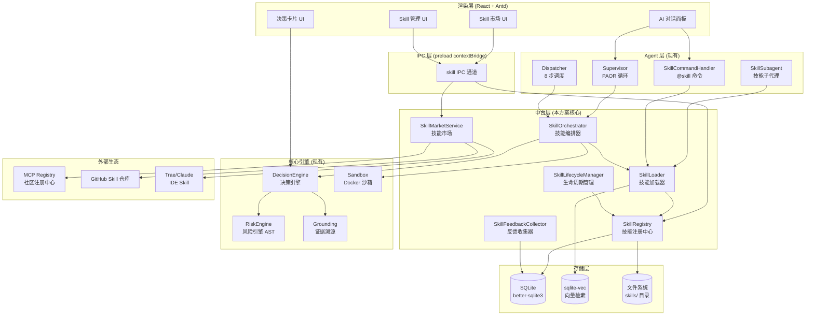
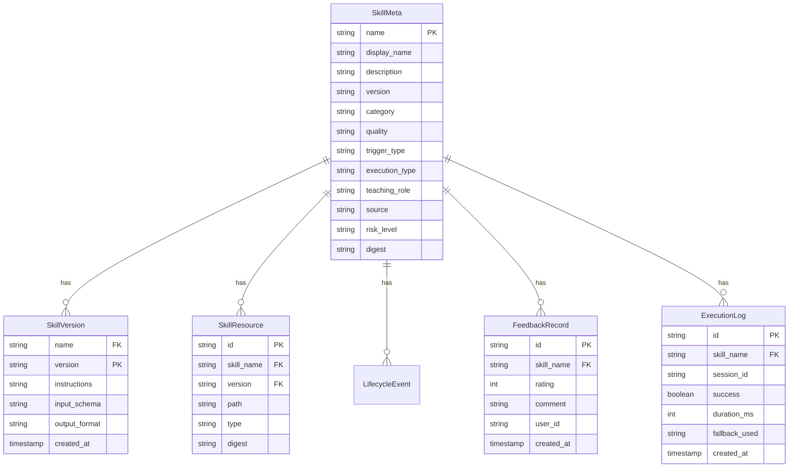
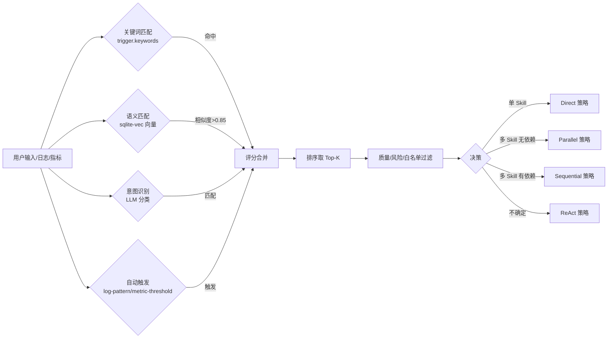
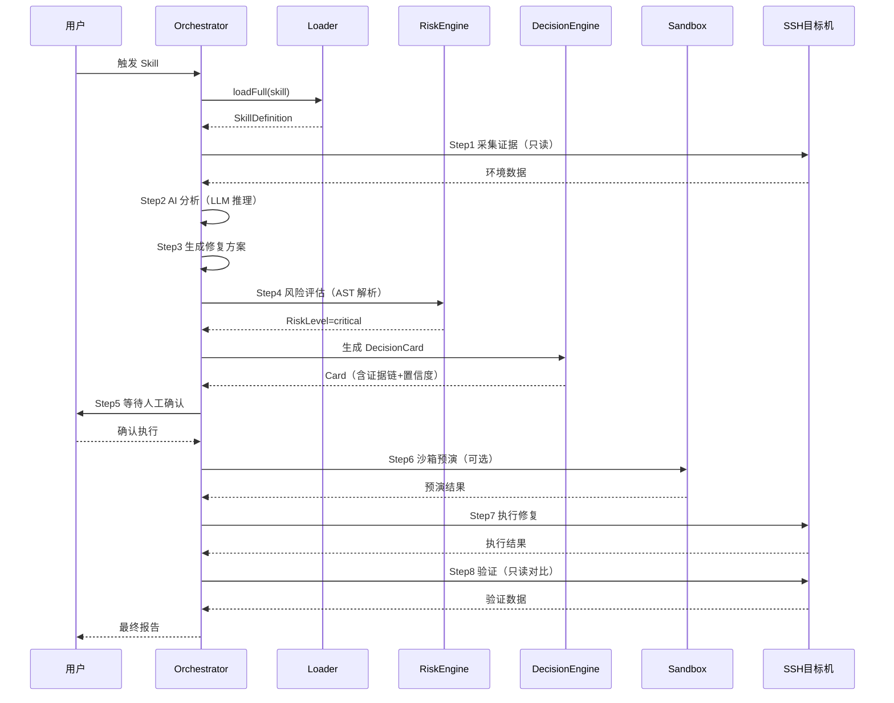
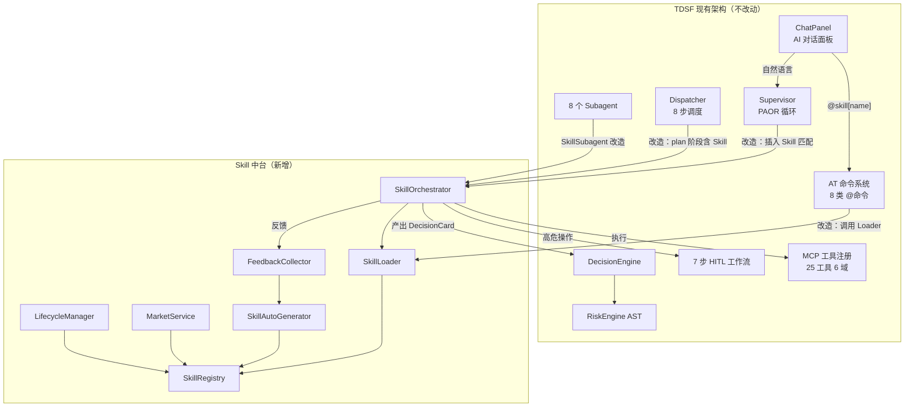
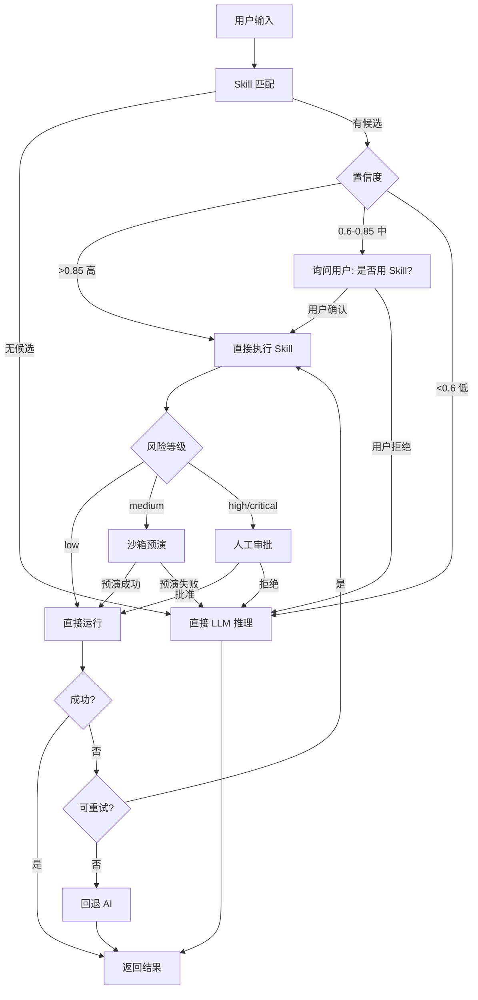
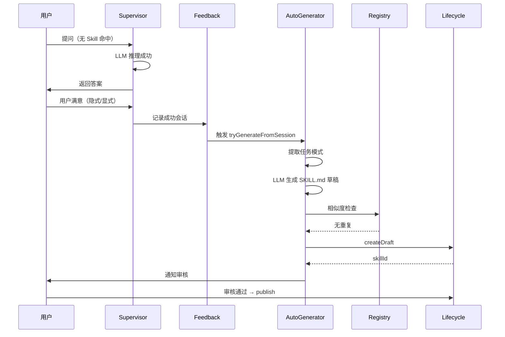
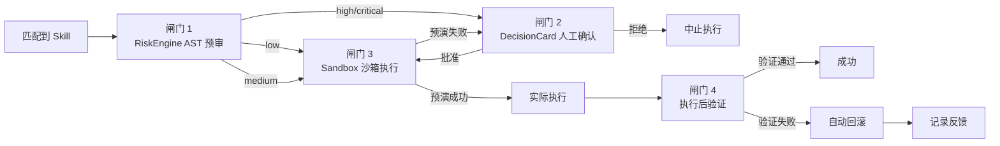
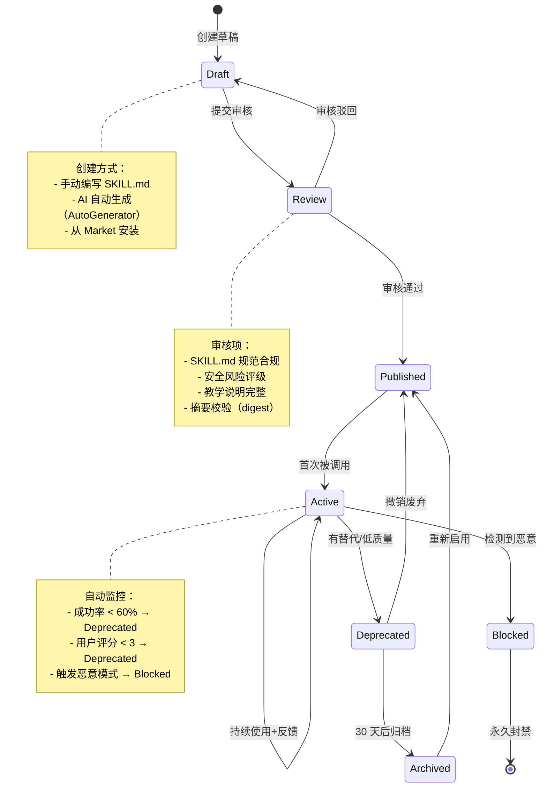

# Skill 中台设计方案

> **项目**：TDSF Linux Desktop（SSH 终端 + AI 辅助 + 高危命令拦截 + 日志分析）
> **版本**：v1.0
> **日期**：2026-07-24
> **作者**：Agent 架构师（联网深度调研产出）
> **配套文档**：
> - `references/technical/SKILL.md`（现有 SKILL 规范实例）
> - `docs/archive/SKILL-CATALOG-v1.0.md`（现有 16 类 Skill 目录）
> - `docs/archive/SKILL-INSTALL-GUIDE.md`（现有安装指南）
> - `src/main/core/agent/at-commands/skill-command.ts`（现有 @skill 命令）
> - `src/main/core/agent/subagents/skill-subagent.ts`（现有 Skill 子代理）
> - `src/main/services/mcp/tools/registry.ts`（现有 MCP 工具注册）

---

## 0. TL;DR（执行摘要）

本方案基于对 **Claude Code Skills / Microsoft Semantic Kernel / LangChain Tools / AutoGPT / CrewAI / Model Context Protocol (MCP)** 六大主流体系的联网深度调研，结合 TDSF Linux Desktop 现有的 **7 步 HITL 工作流 + PAOR 循环 + 8 步 Subagent 调度 + 分域 MCP 注册 + AT 命令注入** 架构，设计一套**与现有架构 100% 兼容、面向运维教学场景**的 Skill 中台。

**核心设计决策**：

1. **不另起炉灶**：复用现有 `skill-command.ts` / `skill-subagent.ts` / `mcp/tools/registry.ts` 三条链路，在其上抽象出 `SkillRegistry` / `SkillLoader` / `SkillOrchestrator` 三层中台。
2. **采用 Claude Code 的 SKILL.md 规范**作为标准载体（YAML frontmatter + 渐进式披露），与 `references/technical/SKILL.md` 现有实例完全兼容。
3. **以 MCP `skill://` URI（SEP-2640 草案）为分发协议**，使 Skill 可跨 IDE（Trae / Claude Code / Cursor）共享。
4. **运维场景三重安全**：RiskEngine AST 预审 → DecisionCard 人工确认 → Sandbox 沙箱执行，三道闸门缺一不可。
5. **教学化设计**：每个 Skill 强制附带 `teaching.md`（含原理、类比、坑点、练习），使工具同时是教材。

**预期收益**：把"经验型运维"沉淀为"可复用技能资产"，让 Agent 从"会查文档"升级为"会按 SOP 操作"，同时为 Linux 初学者提供"每个命令都有教学解释"的学习环境。

---

## 1. 调研综述：六大体系深度对比

### 1.1 调研对象与来源

| 体系 | 维护方 | 核心载体 | 调研来源 |
|------|--------|----------|----------|
| **Claude Code Skills** | Anthropic | `SKILL.md`（YAML frontmatter + Markdown） | 官方 Agent Skills 开放标准（agentskills.io）+ 源码剖析 |
| **Semantic Kernel** | Microsoft | Plugin（Semantic Function + Native Function） | Microsoft Learn 官方文档 + Planner 架构 |
| **LangChain Tools** | LangChain | `Tool` / `Toolkit` + Function Calling | 官方文档 + 2026 框架对比 |
| **AutoGPT** | 开源社区 | 递归 ReAct + 硬编码 command | GitHub 源码 + 框架对比 |
| **CrewAI** | crewAIInc | Agent(Role/Goal/Backstory/Tools) + Crew | GitHub 源码 + 角色化协作 |
| **Model Context Protocol** | Linux Foundation Agentic AI Foundation | Resources / Tools / Prompts / Sampling + `skill://` URI（SEP-2640） | 官方规范 + MCP Registry + SkillHub |

### 1.2 六大体系核心对比表

| 维度 | Claude Code Skills | Semantic Kernel | LangChain Tools | AutoGPT | CrewAI | MCP |
|------|-------------------|-----------------|-----------------|---------|--------|-----|
| **抽象层级** | 皮层（操作手册） | 皮层+手（Plugin+Function） | 手（原子工具） | 手（硬编码 command） | 角色（数字员工） | 协议（连接层） |
| **载体格式** | 文件夹 + SKILL.md | 代码类 + skprompt.txt | Python/JS 函数 | Python 函数 | Python 类 | JSON-RPC + URI |
| **描述方式** | 自然语言 description | JSON Schema + 描述 | JSON Schema | 硬编码描述 | Role/Goal 自然语言 | JSON Schema + URI |
| **加载机制** | 渐进式披露（3 级） | 启动时全量注册 | 按需 import | 启动时全量 | 启动时全量 | 按需 read `skill://` |
| **Token 消耗** | 极低（元数据 ~100 tokens） | 中（全量 Schema） | 中（全量 Schema） | 高（递归循环） | 中（角色背景） | 低（按需） |
| **触发机制** | 关键词 + 语义匹配 + `/` 命令 | Planner 自动规划 | Function Calling | LLM 决策 | LLM 任务委派 | Host 决策 |
| **状态管理** | 无状态（context: fork 除外） | Kernel 依赖注入 | Memory 模块 | 长期记忆 | 共享全局状态 | 无状态 |
| **执行方式** | 注入 prompt + 工具调用 | Native Function 直接执行 | Python 函数 | Python 函数 | Python 函数 | Server 进程 |
| **安全隔离** | allowed-tools 白名单 | 依赖宿主 | 无原生 | 无 | 无 | OAuth 2.1 + 沙箱 |
| **生态分发** | GitHub + skilld/npx | NuGet/pip | pip/npm | GitHub | pip | MCP Registry |
| **可组合性** | 强（多 Skill 叠加） | 强（Planner 编排） | 中（Chain 串联） | 弱（递归） | 强（Crew 协作） | 强（多 Server） |
| **学习曲线** | 低（写 Markdown） | 中（学 Planner） | 高（组件多） | 低（给目标） | 中（角色建模） | 中（学协议） |
| **生产可用** | 高 | 高 | 高 | 低（成本不可控） | 中 | 高 |
| **教学友好** | **高**（手册式） | 中 | 低 | 低 | 中 | 中 |

### 1.3 关键洞察

**洞察 1：Claude Code 的"渐进式披露"是 Token 效率最优解**
- 三级加载：元数据（始终加载，~100 tokens）→ 指令（匹配后加载）→ 支持文件（按需加载）
- 对比 LangChain 全量 Schema 注入，装 50 个 Skill 上下文不会被撑爆
- **TDSF 采纳**：Skill 中台必须实现三级加载

**洞察 2：Semantic Kernel 的"Planner"是编排最优解**
- Action Planner（单函数）/ Sequential Planner（线性链）/ Stepwise Planner（ReAct 动态调整）
- 把"用哪些 Skill、什么顺序"交给元智能体决策
- **TDSF 采纳**：SkillOrchestrator 借鉴三种 Planner 模式

**洞察 3：MCP 的"skill:// URI + Registry"是分发最优解**
- SEP-2640 草案定义 `skill://index.json` 注册中心 + 摘要校验 + 归档解包安全
- 一次封装，处处调用（类似 USB-C）
- **TDSF 采纳**：Skill Market 基于 MCP 协议分发

**洞察 4：现有"硬编码 Skills 是过渡补丁"的批判**
- 业界共识：当前人工硬编码 Skill 脆弱（语义描述偏差→幻觉调用）、维护成本高（API 变动→Skill 失效）
- 演进方向：从"人工编写"走向"智能体自主习得"
- **TDSF 采纳**：设计 `SkillAutoGenerator`，任务完成后自动沉淀新 Skill（第 4.5 节）

**洞察 5：CrewAI 的"角色化"适合教学场景**
- Agent = Role + Goal + Backstory + Tools
- 教学场景中"运维专家/新手导师/安全审计员"角色分工天然适配
- **TDSF 采纳**：Skill 元数据增加 `teachingRole` 字段（第 3.2 节）

### 1.4 选型结论

TDSF Skill 中台采用 **"Claude Code 规范 + Semantic Kernel 编排 + MCP 分发 + TDSF 安全"** 的混合架构：

| 层 | 选型 | 理由 |
|----|------|------|
| Skill 载体 | Claude Code SKILL.md | Token 高效、教学友好、与现有 `references/technical/SKILL.md` 兼容 |
| 编排引擎 | Semantic Kernel Planner 三模式 | 支持"单 Skill 直调 / 多 Skill 串联 / ReAct 动态调整"三种场景 |
| 分发协议 | MCP `skill://` URI + Registry | 跨 IDE 共享、社区生态、与现有 `mcp/tools/registry.ts` 同构 |
| 安全闸门 | TDSF 自有 RiskEngine + DecisionCard + Sandbox | 运维场景高危命令必须三重审批 |
| 角色化 | CrewAI Role 思想（轻量采纳） | 教学场景的"导师/审计员"角色 |

---

## 2. Skill 中台核心架构

### 2.1 总体架构图



### 2.2 五大核心组件

#### 2.2.1 SkillRegistry（技能注册中心）

**职责**：Skill 的注册、发现、版本管理、元数据索引。

**类/接口定义**（TypeScript，与现有 `mcp/tools/registry.ts` 同构）：

```typescript
// src/main/services/skill/registry.ts

/** Skill 元数据（始终加载，~100 tokens） */
export interface SkillMeta {
  /** 唯一标识，kebab-case，如 "linux-oom-kill" */
  name: string
  /** 显示名 */
  displayName: string
  /** 自然语言描述（含触发词，供语义匹配） */
  description: string
  /** 版本号（SemVer） */
  version: string
  /** 分类（参考 SKILL-CATALOG 16 大类） */
  category: SkillCategory
  /** 质量评级 */
  quality: 'must' | 'recommended' | 'optional'
  /** 触发机制配置 */
  trigger: SkillTrigger
  /** 执行类型 */
  execution: SkillExecutionType
  /** 教学角色（CrewAI 借鉴） */
  teachingRole?: 'mentor' | 'auditor' | 'operator' | 'explorer'
  /** 来源 */
  source: 'builtin' | 'trae' | 'claude' | 'custom' | 'market'
  /** 依赖的 MCP 工具白名单 */
  allowedTools?: string[]
  /** 风险等级（影响审批流程） */
  riskLevel: 'low' | 'medium' | 'high' | 'critical'
  /** SKILL.md 文件摘要（SHA-256，SEP-2640 安全） */
  digest?: string
  /** 统计数据（由 FeedbackCollector 更新） */
  stats?: SkillStats
}

/** Skill 完整定义（含指令体，匹配后加载） */
export interface SkillDefinition extends SkillMeta {
  /** SKILL.md 正文（Markdown 指令） */
  instructions: string
  /** 支持文件清单（按需加载） */
  resources: SkillResource[]
  /** 输入参数 Schema（zod） */
  inputSchema?: z.ZodTypeAny
  /** 输出格式声明 */
  outputFormat?: SkillOutputFormat
  /** 教学说明（强制，运维教学场景） */
  teaching: SkillTeaching
}

/** Skill 注册项 */
export interface SkillRegistration {
  meta: SkillMeta
  /** 懒加载入口：按需读取完整定义 */
  load: () => Promise<SkillDefinition>
  /** 卸载钩子 */
  unload?: () => Promise<void>
}

/** Skill 注册中心 */
export class SkillRegistry {
  private skills = new Map<string, SkillRegistration>()
  private versions = new Map<string, Set<string>>() // name → versions

  /** 注册 Skill */
  async register(reg: SkillRegistration): Promise<void>
  /** 注销 Skill */
  async unregister(name: string, version?: string): Promise<void>
  /** 按名查找 */
  get(name: string, version?: string): SkillRegistration | undefined
  /** 列出全部元数据（三级加载第一级） */
  listMeta(filter?: SkillFilter): SkillMeta[]
  /** 语义检索（向量库，复用 sqlite-vec） */
  async search(query: string, limit?: number): Promise<SkillMeta[]>
  /** 关键词匹配（触发词命中） */
  matchByKeyword(input: string): SkillMeta[]
  /** 版本管理：升级/回滚 */
  async upgrade(name: string, targetVersion: string): Promise<void>
  /** 健康检查：所有 Skill 可加载性 */
  async healthCheck(): Promise<SkillHealthReport[]>
}
```

**与现有架构兼容点**：
- 复用 `mcp/tools/registry.ts` 的 `McpToolRegistration` 模式（meta + call 分离）
- 复用 `KnowledgeRepository.search()` 的向量检索能力（`skill-subagent.ts` 已用）
- 元数据存 SQLite（与 `knowledge-repo.ts` 同库），Skill 文件存 `skills/` 目录

#### 2.2.2 SkillLoader（技能加载器）

**职责**：实现 Claude Code 的"渐进式披露"三级加载。

```typescript
// src/main/services/skill/loader.ts

/** 三级加载层级 */
export type LoadLevel = 'meta' | 'instructions' | 'resources'

export class SkillLoader {
  /** L1：加载元数据（启动时全量，~100 tokens/skill） */
  async loadMeta(name: string): Promise<SkillMeta>
  /** L2：加载指令体（匹配命中后，按需） */
  async loadInstructions(name: string): Promise<string>
  /** L3：加载支持文件（指令引用时，按需） */
  async loadResource(name: string, resourcePath: string): Promise<string>
  /** 一次性加载完整定义（用于执行） */
  async loadFull(name: string): Promise<SkillDefinition>
  /** 预加载（高频 Skill 缓存） */
  async preload(names: string[]): Promise<void>
  /** 卸载（LRU 淘汰） */
  async unload(name: string): Promise<void>

  /** 从本地文件系统加载（skills/<name>/SKILL.md） */
  async loadFromFS(skillDir: string): Promise<SkillDefinition>
  /** 从 MCP skill:// URI 加载（SEP-2640） */
  async loadFromMcp(uri: string): Promise<SkillDefinition>
  /** 从归档包加载（.tar.gz / .zip，含安全校验） */
  async loadFromArchive(archivePath: string): Promise<SkillDefinition>
}
```

**安全约束（SEP-2640 采纳）**：
- 归档解包：拒绝 `../` 路径穿越（Zip-Slip）、拒绝逃逸符号链接、限制解压体积（防 decompression bomb）
- 摘要校验：`skill://index.json` 中的 SHA-256 digest 必须与实际 SKILL.md 一致
- 跨域读取：限制 `skill://` 资源只能读取同源文件

#### 2.2.3 SkillOrchestrator（技能编排器）

**职责**：借鉴 Semantic Kernel 三种 Planner，实现 Skill 的单点直调、线性串联、ReAct 动态编排。

```typescript
// src/main/services/skill/orchestrator.ts

/** 编排策略 */
export type OrchestrationStrategy =
  | 'direct'        // Action Planner：单 Skill 直调
  | 'sequential'    // Sequential Planner：线性链
  | 'react'         // Stepwise Planner：ReAct 动态调整
  | 'parallel'      // 并行执行（无依赖 Skill）

/** 编排请求 */
export interface OrchestrateRequest {
  /** 用户原始输入 */
  userInput: string
  /** 强制指定 Skill（@skill 命令） */
  forcedSkill?: string
  /** 策略（不传由 Orchestrator 自选） */
  strategy?: OrchestrationStrategy
  /** 会话上下文（SSH session、历史决策） */
  context: OrchestrationContext
  /** 最大步数（防 ReAct 死循环） */
  maxSteps?: number
}

/** 编排结果 */
export interface OrchestrateResult {
  /** 执行的 Skill 链 */
  executed: Array<{ name: string; input: unknown; output: unknown; durationMs: number }>
  /** 是否触发人工审批 */
  requiresApproval: boolean
  /** 生成的决策卡片（如有高危操作） */
  decisionCard?: DecisionCard
  /** 最终输出 */
  output: string
  /** 失败回退信息 */
  fallbackUsed?: 'ai' | 'generic' | 'none'
}

export class SkillOrchestrator {
  /** 主入口：根据输入选择策略并执行 */
  async orchestrate(req: OrchestrateRequest): Promise<OrchestrateResult>

  /** 策略 1：单 Skill 直调（Action Planner 模式） */
  private async executeDirect(
    skill: SkillMeta, input: unknown, ctx: OrchestrationContext
  ): Promise<OrchestrateResult>

  /** 策略 2：线性串联（Sequential Planner 模式） */
  private async executeSequential(
    chain: SkillMeta[], input: unknown, ctx: OrchestrationContext
  ): Promise<OrchestrateResult>

  /** 策略 3：ReAct 动态编排（Stepwise Planner 模式） */
  private async executeReact(
    initialSkills: SkillMeta[], goal: string, ctx: OrchestrationContext, maxSteps: number
  ): Promise<OrchestrateResult>

  /** 策略 4：并行执行 */
  private async executeParallel(
    skills: SkillMeta[], input: unknown, ctx: OrchestrationContext
  ): Promise<OrchestrateResult>

  /** Skill 失败时回退到 AI（LLM 直接推理） */
  private async fallbackToAI(
    failedSkill: string, input: unknown, ctx: OrchestrationContext
  ): Promise<OrchestrateResult>

  /** 自动选择策略（基于输入复杂度 + Skill 数量） */
  private selectStrategy(input: string, candidates: SkillMeta[]): OrchestrationStrategy
}
```

**与现有架构兼容点**：
- `executeDirect` 复用 `SkillSubagent.doExecute()` 的"知识库检索 + LLM 生成指南"主路径
- `fallbackToAI` 复用 `SkillSubagent.buildGenericGuide()` 的降级逻辑
- 编排结果产出 `DecisionCard`，无缝接入现有 `DecisionEngine.generateDecisionCard()`
- 高危操作经 `RiskEngine.assessRisk()` 预审，触发 7 步 HITL 的 `confirm` 步骤

#### 2.2.4 SkillLifecycleManager（生命周期管理）

**职责**：管理 Skill 从创建到废弃的 7 个阶段。

```typescript
// src/main/services/skill/lifecycle.ts

export type SkillPhase =
  | 'draft'      // 草稿（创建中）
  | 'review'     // 审核（社区/管理员审查）
  | 'published'  // 发布（Market 上架）
  | 'active'     // 使用中（被调用过）
  | 'deprecated' // 废弃声明（有替代方案）
  | 'archived'   // 归档（下架但保留）
  | 'blocked'    // 封禁（违规或恶意）

export interface LifecycleEvent {
  skillName: string
  phase: SkillPhase
  timestamp: number
  actor: 'user' | 'admin' | 'system' | 'ai'
  reason: string
  metadata?: Record<string, unknown>
}

export class SkillLifecycleManager {
  /** 创建草稿 */
  async createDraft(author: string, draft: SkillDefinitionDraft): Promise<string>
  /** 提交审核 */
  async submitForReview(name: string): Promise<void>
  /** 审核通过并发布 */
  async publish(name: string, reviewer: string): Promise<void>
  /** 标记废弃 */
  async deprecate(name: string, reason: string, replacement?: string): Promise<void>
  /** 归档 */
  async archive(name: string): Promise<void>
  /** 封禁 */
  async block(name: string, reason: string): Promise<void>
  /** 查询生命周期历史 */
  getHistory(name: string): LifecycleEvent[]
  /** 当前状态 */
  getPhase(name: string): SkillPhase
}
```

#### 2.2.5 SkillMarketService（技能市场）

**职责**：Skill 的分享、评分、推荐、安装。

```typescript
// src/main/services/skill/market.ts

export class SkillMarketService {
  /** 浏览市场（分类/排序/筛选） */
  async browse(filter: MarketFilter): Promise<MarketListing[]>
  /** 搜索 */
  async search(query: string): Promise<MarketListing[]>
  /** 安装 Skill（从 MCP Registry / GitHub / 归档包） */
  async install(source: SkillSource): Promise<InstallResult>
  /** 卸载 */
  async uninstall(name: string): Promise<void>
  /** 更新 */
  async update(name: string): Promise<UpdateResult>
  /** 评分（1-5 星 + 评论） */
  async rate(name: string, score: number, comment?: string): Promise<void>
  /** 推荐基于使用历史 */
  async recommend(context: RecommendContext): Promise<SkillMeta[]>
  /** 上传分享到市场 */
  async publish(name: string, visibility: 'public' | 'private' | 'team'): Promise<void>
}
```

### 2.3 数据模型



---

## 3. Skill 规范设计

### 3.1 SKILL.md 格式规范（v2.0）

**设计原则**：
1. **完全兼容 Claude Code 官方规范**（agentskills.io 开放标准）
2. **向后兼容 TDSF 现有 `references/technical/SKILL.md`**
3. **扩展运维教学字段**（`teaching` / `risk` / `rollback`）

#### 3.1.1 完整 frontmatter 规范

```yaml
---
# === 基础字段（Claude Code 官方规范，必填）===
name: "linux-oom-kill"                    # kebab-case，全局唯一
description: "处理 Linux OOM Killer 触发的内存不足问题。当系统日志出现 oom-killer、out of memory、killed process 时使用。触发词：OOM/内存不足/进程被杀/out of memory/oom killer。"

# === Claude Code 扩展字段（可选）===
argument-hint: "[进程名|端口]"             # /slash 命令补全提示
disable-model-invocation: false           # true=仅用户触发
user-invocable: true                      # false=仅 AI 触发
allowed-tools: Read, Grep, ssh-exec, monitor-get  # 工具白名单
model: sonnet                             # sonnet/opus/haiku
effort: high                              # low/medium/high/max
context: fork                             # fork=独立 subagent 上下文
agent: Explore                            # context:fork 时指定 agent

# === TDSF 扩展字段（v2.0 新增，运维场景）===
version: "1.2.0"                          # SemVer
category: "linux-ops"                     # SKILL-CATALOG 16 大类
quality: "must"                           # must/recommended/optional
teaching-role: "mentor"                   # mentor/auditor/operator/explorer
risk-level: "high"                        # low/medium/high/critical
execution-type: "hybrid"                  # local-command/api-call/ai-call/hybrid
trigger:                                  # 触发机制配置
  keywords: ["oom", "out of memory", "killed process", "内存不足"]
  semantic: true                          # 启用向量语义匹配
  intent: "diagnose-and-fix"              # 意图分类
  auto-trigger:                           # 自动触发场景
    - log-pattern: "oom[- ]?killer|out of memory"
      severity: "critical"
    - metric-threshold: "memory_usage > 90%"
      duration: "5m"

# === 安全字段（运维场景强制）===
rollback:                                 # 回滚方案（强制）
  command: "systemctl restart <service>"
  timeout: 30
approval-required: true                   # 是否需要人工审批
sandbox-execution: false                  # 是否强制沙箱执行
max-impact-scope: "single-service"        # single-service/system-wide/data-loss

# === 教学字段（TDSF 教学场景强制）===
teaching:                                 # 教学说明
  principle: "OOM Killer 是内核保护机制，杀掉内存占用最大的进程以保护系统"
  analogy: "像电路过载时跳闸保护，牺牲一路电器保全整机"
  prerequisites: ["Linux 内存管理基础", "进程状态", "journalctl 用法"]
  common-pitfalls:
    - "不要盲目重启服务，先查清内存泄漏根因"
    - "oom_score_adj 调整是临时方案，不是根治"
  exercises:
    - "用 stress-ng 模拟内存压力，观察 OOM 触发"
    - "调整 /proc/<pid>/oom_score_adj，对比效果"

# === 钩子字段 ===
hooks:                                    # Claude Code 生命周期钩子
  PreToolUse:
    - matcher: "Bash"
      hooks:
        - type: command
          command: "./validate-oom.sh"
---
```

#### 3.1.2 正文结构规范

```markdown
# <Skill 显示名>

> **一句话简介**：<做什么 + 何时用>

## 何时调用本 Skill

**必须调用场景**：
- <场景 1，含触发词>
- <场景 2>

**不要调用场景**：
- <不适用场景 1>
- <不适用场景 2>

## 前置条件
- <权限/环境要求>

## 执行步骤

### Step 1: 采集证据
<具体命令 + 预期输出>

### Step 2: 分析根因
<判断逻辑 + 决策树>

### Step 3: 执行修复
<修复命令 + 安全检查>

### Step 4: 验证结果
<验证方法>

## 回滚方案
<回滚步骤>

## 教学说明
<原理 / 类比 / 坑点 / 练习>

## 与其他 Skill 的配合
| 配合 Skill | 何时配合 |
|-----------|---------|

## 反模式清单（不要做）
- ❌ <反模式 1>

## 版本历史
| 版本 | 日期 | 变更 |
```

### 3.2 元数据结构详解

| 字段 | 类型 | 必填 | 说明 |
|------|------|------|------|
| `name` | string | ✅ | kebab-case 唯一标识 |
| `description` | string | ✅ | 含触发词，供语义匹配 |
| `version` | SemVer | ✅ | 语义化版本 |
| `category` | enum | ✅ | 16 大类之一 |
| `quality` | enum | ✅ | must/recommended/optional |
| `trigger` | object | ✅ | 触发配置 |
| `trigger.keywords` | string[] | ✅ | 关键词列表 |
| `trigger.semantic` | boolean | ❌ | 启用向量匹配（默认 true） |
| `trigger.auto-trigger` | object[] | ❌ | 自动触发规则（日志/指标/定时） |
| `execution-type` | enum | ✅ | local-command/api-call/ai-call/hybrid |
| `teaching-role` | enum | ❌ | mentor/auditor/operator/explorer |
| `risk-level` | enum | ✅ | low/medium/high/critical |
| `rollback` | object | ❌ | 高危操作强制 |
| `approval-required` | boolean | ❌ | 默认 risk-level≥high 时 true |
| `sandbox-execution` | boolean | ❌ | 数据破坏类操作强制 |
| `teaching` | object | ❌ | 教学场景强制 |
| `allowed-tools` | string[] | ❌ | 工具白名单 |
| `digest` | string | ❌ | SHA-256 摘要（Market 分发） |

### 3.3 触发机制设计



**四级触发机制**：

| 级别 | 机制 | 实现 | 成本 | 准确率 |
|------|------|------|------|--------|
| L1 | 关键词匹配 | `trigger.keywords` 正则/包含 | 极低 | 高（精确） |
| L2 | 语义匹配 | sqlite-vec 向量余弦相似度 | 低 | 中高 |
| L3 | 意图识别 | LLM 单次分类调用 | 中 | 高 |
| L4 | 自动触发 | 日志模式/指标阈值/定时任务 | 低 | 确定 |

**触发评分公式**：
```
score(skill, input) = w1 * keyword_hit + w2 * semantic_sim + w3 * intent_match + w4 * history_ctr
默认权重：w1=0.3, w2=0.3, w3=0.2, w4=0.2
历史点击率（CTR）由 FeedbackCollector 维护
```

### 3.4 执行机制设计

| 执行类型 | 实现 | 适用场景 | 安全等级 |
|----------|------|----------|----------|
| `local-command` | 直接调用 `ssh-exec` MCP 工具 | 只读诊断命令 | 低 |
| `api-call` | 调用 HTTP API | 外部服务集成 | 中 |
| `ai-call` | 注入 prompt 给 LLM | 分析/建议/解释 | 低 |
| `hybrid` | 多步混合（采集→AI分析→执行→验证） | 运维修复全流程 | 高 |

**hybrid 执行流程**（最复杂，对应 7 步 HITL）：


### 3.5 反馈机制设计

```typescript
// src/main/services/skill/feedback.ts

export interface SkillFeedback {
  skillName: string
  sessionId: string
  /** 执行成功/失败 */
  success: boolean
  /** 耗时 */
  durationMs: number
  /** 是否触发回退 */
  fallbackUsed: 'none' | 'ai' | 'generic'
  /** 用户评分（1-5，可选） */
  userRating?: number
  /** 用户评论 */
  comment?: string
  /** 失败原因 */
  failureReason?: string
  /** 实际输出 vs 预期差异 */
  outputDiff?: string
}

export class SkillFeedbackCollector {
  /** 记录执行反馈 */
  async record(feedback: SkillFeedback): Promise<void>
  /** 计算统计指标 */
  getStats(skillName: string): SkillStats
  /** 自动优化建议（基于反馈数据） */
  async generateOptimizationSuggestions(skillName: string): Promise<string[]>
  /** 低质量 Skill 告警（成功率<60%） */
  async alertLowQuality(): Promise<string[]>
}
```

**自动优化机制**：
- 成功率 < 60% → 触发 `SkillAutoGenerator` 重写指令
- 用户评分 < 3 星 → 标记 `deprecated` 进入审核
- 高频失败步骤 → 自动追加 `common-pitfalls` 条目
- 高频回退到 AI → 考虑合并 Skill 或调整触发词

---

## 4. Agent 架构中的 Skill 集成

### 4.1 集成总览：与现有架构的对接点



### 4.2 改造点清单（最小侵入）

| # | 现有文件 | 改造内容 | 侵入度 |
|---|----------|----------|--------|
| 1 | `at-commands/skill-command.ts` | `resolve()` 内调用 `SkillLoader.loadMeta()` 校验 skill 存在性 | 低 |
| 2 | `subagents/skill-subagent.ts` | `searchSkills()` 改为调用 `SkillRegistry.search()` 而非直接查 `KnowledgeRepository` | 中 |
| 3 | `supervisor.ts` | PAOR `plan` 阶段插入 `SkillOrchestrator.matchByInput()` 匹配 | 中 |
| 4 | `dispatcher.ts` | `analyze` 步骤增加 Skill 候选识别 | 低 |
| 5 | `agent-workflow.ts` | 7 步 HITL 的 `reason` 步骤优先调用匹配的 Skill | 中 |
| 6 | `mcp/tools/registry.ts` | 新增 `skill` 域注册（与 ssh/knowledge/log/monitor/sandbox 并列） | 低 |
| 7 | `ipc/index.ts` | 新增 `skill:*` IPC 通道（market/lifecycle/feedback） | 低 |

**关键原则**：所有改造都是"在现有调用前插入 Skill 匹配"，不破坏现有降级路径。Skill 匹配失败时回退到原有 LLM 直推。

### 4.3 Agent 主循环中的 Skill 匹配插入

以 **Supervisor PAOR 循环**为例，Skill 匹配插入位置：

```typescript
// supervisor.ts 改造伪代码（仅展示 plan 阶段插入点）

async function runPaorLoop(input: ChatParams, /* ... */) {
  for (const phase of ['plan', 'act', 'observe', 'reflect']) {
    if (phase === 'plan') {
      // === 新增：Skill 匹配插入 ===
      const candidates = await skillOrchestrator.matchByInput(input.messages)
      if (candidates.length > 0) {
        const topSkill = candidates[0]
        if (topSkill.meta.confidence > 0.85) {
          // 高置信度：直接走 Skill 执行
          const result = await skillOrchestrator.orchestrate({
            userInput: extractUserText(input.messages),
            forcedSkill: topSkill.meta.name,
            context: { sshSessionId: input.sshSessionId, /* ... */ },
          })
          if (result.requiresApproval) {
            await this.requestApproval(result.decisionCard) // 触发 HITL
          }
          return result.output // Skill 成功，跳过后续 PAOR
        }
        // 中置信度：把 Skill 作为 plan 的建议工具
        planHints = candidates.map(c => `可用 Skill: ${c.meta.name} - ${c.meta.description}`)
      }
      // === 插入结束 ===

      const plan = await this.planPhase(input, planHints) // 原有逻辑
    }
    // ... act/observe/reflect 原有逻辑
  }
}
```

### 4.4 Agent 自主决定是否调用 Skill

**决策树**（嵌入 Orchestrator）：



### 4.5 Skill 失败回退到 AI

```typescript
// orchestrator.ts 中的回退逻辑

private async executeWithFallback(
  skill: SkillMeta, input: unknown, ctx: OrchestrationContext
): Promise<OrchestrateResult> {
  const maxRetries = 1 // Skill 失败只重试 1 次

  for (let attempt = 0; attempt <= maxRetries; attempt++) {
    try {
      const result = await this.executeSkill(skill, input, ctx)
      await this.feedback.record({
        skillName: skill.name,
        success: true,
        durationMs: result.durationMs,
        fallbackUsed: 'none',
      })
      return result
    } catch (err) {
      this.log.warn(`Skill ${skill.name} 第 ${attempt + 1} 次执行失败`, { error: err })

      if (attempt < maxRetries) {
        await this.delay(1000 * (attempt + 1)) // 指数退避
        continue
      }

      // 最终失败：回退到 AI
      this.log.info(`Skill ${skill.name} 失败，回退到 LLM 推理`)
      const aiResult = await this.fallbackToAI(skill.name, input, ctx)
      await this.feedback.record({
        skillName: skill.name,
        success: false,
        durationMs: aiResult.durationMs,
        fallbackUsed: 'ai',
        failureReason: err instanceof Error ? err.message : String(err),
      })
      return aiResult
    }
  }
  throw new Error('unreachable')
}

/** 回退到 AI：把 Skill 的 instructions 作为参考上下文，让 LLM 自由推理 */
private async fallbackToAI(
  failedSkill: string, input: unknown, ctx: OrchestrationContext
): Promise<OrchestrateResult> {
  // 复用 SkillSubagent.buildGenericGuide() 的降级思路
  const skillDef = await this.loader.loadFull(failedSkill).catch(() => null)
  const referenceHint = skillDef
    ? `\n\n[参考 Skill: ${failedSkill} 的预期流程]\n${skillDef.instructions.slice(0, 500)}`
    : ''

  const messages: ModelMessage[] = [
    { role: 'system', content: `你是 Linux 运维助手。Skill "${failedSkill}" 执行失败，请直接推理解决用户问题。${referenceHint}` },
    { role: 'user', content: JSON.stringify(input) },
  ]

  const result = await getSupervisor().chat({ messages, /* ... */ })
  return {
    executed: [],
    requiresApproval: false,
    output: result.text,
    fallbackUsed: 'ai',
  }
}
```

### 4.6 任务完成后自动生成新 Skill

```typescript
// src/main/services/skill/auto-generator.ts

export class SkillAutoGenerator {
  /**
   * 当 Agent 成功完成一次任务（无 Skill 命中、纯 LLM 推理成功）时，
   * 自动把解决过程沉淀为新 Skill 草稿。
   */
  async tryGenerateFromSession(sessionId: string): Promise<string | null> {
    const session = await this.loadSession(sessionId)
    if (!this.shouldGenerate(session)) return null

    // 1. 提取任务模式（用户输入 + 成功路径）
    const pattern = await this.extractPattern(session)

    // 2. 生成 Skill 草稿（LLM 生成 SKILL.md）
    const draft = await this.llmGenerateDraft(pattern)

    // 3. 相似度检查（避免重复）
    const existing = await this.registry.search(draft.description, 5)
    if (existing.some(s => this.similarity(s, draft) > 0.9)) {
      this.log.info('已存在高度相似 Skill，跳过生成')
      return null
    }

    // 4. 创建草稿（进入 lifecycle draft 阶段）
    const skillId = await this.lifecycle.createDraft('ai-auto', draft)

    // 5. 通知用户审核
    this.notifyUser(skillId, 'AI 自动生成了新 Skill 草稿，请审核')
    return skillId
  }

  /** 触发条件：用户明确成功 + 无 Skill 命中 + 执行步骤≥3 */
  private shouldGenerate(session: SessionRecord): boolean {
    return session.success
      && session.matchedSkills.length === 0
      && session.executedSteps.length >= 3
      && session.userSatisfaction !== 'negative'
  }
}
```

**自动生成流程图**：



---

## 5. 运维场景的 Skill 中台设计

### 5.1 运维 Skill 分类体系

基于现有 `SKILL-CATALOG-v1.0.md` 的 16 大类，聚焦运维场景细化为 **6 大运维域**：

| 域 | 类别 | Skill 示例 | 风险等级 |
|----|------|-----------|----------|
| **网络** | linux-ops/network | nginx-5xx-diagnose / conn-refused-fix / dns-resolve | medium |
| **存储** | linux-ops/storage | disk-full-cleanup / fs-readonly-fix / nfs-mount-fix | high |
| **内存** | linux-ops/memory | oom-kill-analysis / memory-leak-trace / swap-tune | high |
| **进程** | linux-ops/process | high-cpu-trace / zombie-clean / service-restart | medium |
| **安全** | linux-ops/security | selinux-triage / firewall-rules / auth-fail-analyze | high |
| **性能** | linux-ops/performance | load-average-tune / io-bottleneck / kernel-param-tune | medium |

### 5.2 触发场景设计

#### 5.2.1 报错自动触发

```typescript
// 自动触发配置（SKILL.md frontmatter）
trigger:
  auto-trigger:
    - log-pattern: "oom[- ]?killer|out of memory|killed process"
      severity: "critical"
      skill: "linux-oom-kill"
    - log-pattern: "no space left on device"
      severity: "critical"
      skill: "disk-full-cleanup"
    - log-pattern: "connection refused|ECONNREFUSED"
      severity: "warning"
      skill: "conn-refused-fix"
```

**集成点**：现有 `agent-workflow.ts` 的 `LOG_PATTERNS` 数组（已定义 15 个模式），增加 `skillName` 字段，匹配后自动触发对应 Skill。

#### 5.2.2 用户提问触发

用户在 ChatPanel 输入"服务为什么变慢了"：
1. `SkillOrchestrator.matchByInput()` 检测关键词"变慢"
2. 语义匹配到 `high-cpu-trace` / `load-average-tune` 候选
3. 询问用户确认或自动选择 Top-1 执行

#### 5.2.3 定时巡检触发

```typescript
// 集成现有 scheduler/daily-health-check.ts
trigger:
  auto-trigger:
    - metric-threshold: "memory_usage > 90%"
      duration: "5m"
      skill: "memory-leak-trace"
    - metric-threshold: "disk_usage > 85%"
      duration: "10m"
      skill: "disk-full-cleanup"
    - cron: "0 9 * * *"  // 每天 9 点巡检
      skill: "daily-health-check"
```

### 5.3 执行安全设计（三重闸门）



**闸门 1：RiskEngine AST 预审**（复用现有 `risk-engine-ast.ts`）
- 解析修复命令的 AST
- 命中 12 条黑名单（`rm -rf /` / `mkfs` / `dd if=/dev/zero` / `:(){:|:&};:` 等）→ 直接阻止
- 写操作（`systemctl stop` / `kill -9` / `chmod 777`）→ 标记 high
- 只读操作（`cat` / `ps` / `journalctl`）→ 标记 low

**闸门 2：DecisionCard 人工确认**（复用现有 `decision-engine.ts`）
- 生成包含"问题/假设/证据链/置信度/风险/修复命令/回滚命令"的完整卡片
- 通过 IPC 推送到前端 `DecisionCard` 组件
- 用户三选一：批准 / 拒绝 / 修改
- 5 分钟超时自动拒绝（防误操作）

**闸门 3：Sandbox 沙箱执行**（复用现有 `sandbox/openhands-runner.ts`）
- Docker 容器内预演修复命令
- 对比执行前后状态差异
- 预演失败 → 回到闸门 2 重新确认

**闸门 4：执行后验证**（复用 7 步 HITL 的 `verify` 步骤）
- 采集执行后环境状态
- 与预期对比（如：磁盘空间是否释放、服务是否恢复）
- 验证失败 → 自动执行回滚命令

### 5.4 教学化设计

**每个运维 Skill 强制包含 `teaching` 字段**：

```yaml
teaching:
  principle: "OOM Killer 是内核保护机制..."
  analogy: "像电路过载跳闸..."
  prerequisites: ["Linux 内存管理基础"]
  common-pitfalls:
    - "不要盲目重启服务"
  exercises:
    - "用 stress-ng 模拟内存压力"
```

**教学化 UI 展示**（前端改造）：
- DecisionCard 旁增加"📖 为什么？"按钮，点击展示 `teaching.principle` + `analogy`
- 命令执行前显示"⚠️ 常见坑点"提示
- 任务完成后推送"🎓 相关练习"

**教学角色映射**（CrewAI 借鉴）：

| 角色 | teachingRole | 行为 | 适用 Skill |
|------|--------------|------|-----------|
| 导师 | mentor | 详细解释原理 + 引导学习 | 诊断类、分析类 |
| 审计员 | auditor | 严格审查风险 + 提示坑点 | 高危操作类 |
| 操作员 | operator | 简洁执行 + 最少解释 | 只读查询类 |
| 探索者 | explorer | 鼓励尝试 + 容错 | 性能调优类 |

---

## 6. Skill 生命周期流程



### 6.1 生命周期阶段详解

| 阶段 | 触发条件 | 可执行操作 | 超时处理 |
|------|----------|-----------|----------|
| **draft** | 手动创建 / AI 生成 / Market 安装 | 编辑、测试、提交审核 | 90 天无操作 → 归档 |
| **review** | draft 提交审核 | 管理员/社区审查 | 30 天无决议 → 自动发布（低风险）或拒绝（高风险） |
| **published** | 审核通过 | 被匹配、执行、反馈 | — |
| **active** | 首次被调用 | 持续收集反馈、自动优化 | 180 天无调用 → deprecated |
| **deprecated** | 有替代方案 / 成功率低 / 评分低 | 仍可执行但提示风险 | 30 天 → archived |
| **archived** | 下架保留 | 仅查询历史 | 永久保留（可恢复） |
| **blocked** | 检测到恶意行为 | 禁止执行 | 永久封禁 |

### 6.2 审核标准

| 审核项 | 通过标准 | 不通过处理 |
|--------|----------|-----------|
| SKILL.md 规范 | frontmatter 必填字段完整 | 驳回修改 |
| 安全风险评级 | risk-level 与实际命令匹配 | 调整评级 |
| 教学说明 | teaching 字段完整（教学场景） | 补充 |
| 摘要校验 | digest 与 SKILL.md 一致 | 拒绝（防篡改） |
| 归档安全 | 无路径穿越/符号链接逃逸 | 拒绝 |
| 依赖工具 | allowed-tools 在白名单内 | 调整 |

---

## 7. 与现有 Agent 框架的对比

### 7.1 TDSF Skill 中台 vs 六大体系

| 维度 | TDSF Skill 中台 | Claude Code | Semantic Kernel | LangChain | AutoGPT | CrewAI | MCP |
|------|----------------|-------------|-----------------|-----------|---------|--------|-----|
| **载体** | SKILL.md v2.0（兼容 Claude Code + 扩展） | SKILL.md | Plugin 代码 | Tool 函数 | command 函数 | Agent 类 | JSON-RPC |
| **加载** | 三级渐进式披露 | 三级 | 全量 | 全量 | 全量 | 全量 | 按需 |
| **编排** | 4 策略（direct/seq/react/parallel） | 无原生 | 3 Planner | Chain | 递归 | Crew | 无 |
| **安全** | **三重闸门**（AST+DecisionCard+Sandbox） | allowed-tools | 宿主依赖 | 无 | 无 | 无 | OAuth+沙箱 |
| **回退** | **Skill 失败→AI** | 无 | 无 | 无 | 无 | 无 | 无 |
| **自进化** | **AutoGenerator 自动沉淀** | 无 | 无 | 无 | 无 | 无 | 无 |
| **教学** | **teaching 字段强制** | 无 | 无 | 无 | 无 | 角色 | 无 |
| **运维适配** | **6 大运维域 + 自动触发** | 通用 | 通用 | 通用 | 通用 | 通用 | 通用 |
| **反馈** | FeedbackCollector + 自动优化 | 无 | 无 | 无 | 无 | 无 | 无 |
| **分发** | MCP skill:// + Market | GitHub | NuGet/pip | pip | GitHub | pip | MCP Registry |

### 7.2 TDSF Skill 中台的独特价值

1. **运维场景深度定制**：6 大运维域 + 日志/指标/定时自动触发，通用框架不具备
2. **三重安全闸门**：AST 预审 + DecisionCard 人工确认 + Sandbox 沙箱，远超通用框架的"allowed-tools 白名单"
3. **教学化原生支持**：`teaching` 字段 + 4 种教学角色 + 练习题，把工具变教材
4. **自进化闭环**：AutoGenerator 把成功会话自动沉淀为 Skill 草稿，解决"硬编码 Skill 维护成本高"痛点
5. **失败回退机制**：Skill 失败自动回退到 LLM 推理，保证用户体验不中断
6. **与现有架构零冲突**：所有改造都是"在现有调用前插入匹配"，不破坏降级路径

---

## 8. 实施路线图

### 8.1 分阶段交付

| 阶段 | 周期 | 交付内容 | 验收标准 |
|------|------|----------|----------|
| **P0 基座** | 第 1 周 | SkillRegistry + SkillLoader + SKILL.md v2.0 规范 | 能注册/加载/检索 5 个内置 Skill |
| **P1 集成** | 第 2 周 | 改造 skill-subagent + at-commands + MCP skill 域 | @skill 命令走 Registry，SkillSubagent 走 Loader |
| **P2 编排** | 第 3 周 | SkillOrchestrator（4 策略）+ 失败回退 | 能串联 2+ Skill，失败回退 AI |
| **P3 安全** | 第 4 周 | 三重闸门接入（RiskEngine+DecisionCard+Sandbox） | 高危操作必须审批 |
| **P4 教学** | 第 5 周 | teaching 字段 + UI 展示 + 4 角色映射 | 每个 Skill 有教学说明 |
| **P5 市场** | 第 6 周 | SkillMarketService + MCP skill:// 分发 | 能从 GitHub 安装 Skill |
| **P6 自进化** | 第 7 周 | AutoGenerator + FeedbackCollector | 成功会话自动生成 Skill 草稿 |

### 8.2 与比赛冲刺的优先级

考虑到比赛截止 **2026-07-30**，建议：

**比赛前必做（P0+P1 简化版）**：
- SkillRegistry + SkillLoader（最小实现）
- 改造 skill-subagent 走 Registry
- 内置 5 个核心运维 Skill（oom/disk-full/conn-refused/high-cpu/service-restart）

**比赛后迭代（P2-P6）**：
- 完整编排 + 安全闸门 + 教学 + 市场 + 自进化

---

## 9. 风险与缓解

| 风险 | 影响 | 缓解措施 |
|------|------|----------|
| Skill 描述偏差导致幻觉调用 | 错误 Skill 执行 | 四级触发 + 置信度阈值 + 用户确认 |
| 高危 Skill 被误触发 | 系统损坏 | 三重闸门 + 回滚命令 + 沙箱预演 |
| Skill 数量膨胀后检索慢 | 用户体验差 | sqlite-vec 向量索引 + LRU 缓存 + 质量过滤 |
| 自动生成 Skill 质量低 | 噪音 Skill | draft 阶段审核 + 相似度去重 + 反馈驱动淘汰 |
| MCP skill:// 协议未定型（SEP-2640 草案） | 兼容性风险 | 抽象 Loader 接口，协议变更只改适配层 |
| 与现有 PAOR/HITL 集成复杂度 | 改造风险 | 最小侵入原则 + 所有改造可降级到原路径 |

---

## 10. 参考资料

### 10.1 调研来源

| # | 来源 | 关键信息 |
|---|------|----------|
| 1 | Claude Code Skills 完全指南（腾讯云开发者） | SKILL.md 结构、渐进式披露、三种 Skills 类型 |
| 2 | Claude Code Skills 源码剖析（小林coding） | 渐进式披露源码实现、三级加载 Token 消耗 |
| 3 | Agent Skills 开放标准（agentskills.io） | 跨 IDE 共享规范、frontmatter 字段 |
| 4 | Microsoft Semantic Kernel 官方文档 | Plugin/Function/Planner 架构、Kernel 依赖注入 |
| 5 | 2026 AI Agent 框架深度对比（CSDN） | LangChain/AutoGPT/CrewAI 架构对比、ReAct 伪代码 |
| 6 | AutoGPT/LangChain/CrewAI 三大框架对比（掘金） | 框架核心代码、适用场景、局限性 |
| 7 | Model Context Protocol 深度研究报告（腾讯云） | MCP 架构、JSON-RPC、Host/Client/Server 角色 |
| 8 | SEP-2640 Skills-over-MCP 草案（HuggingFace） | skill:// URI、digest 校验、归档安全、目录读取 |
| 9 | SkillHub MCP 广场（腾讯云） | 27 个 MCP Server 分类、11 类别市场设计 |
| 10 | Agent 从搭框架到装技能包（掘金） | 大脑-皮层-手三层架构、Anthropic vs 微软 vs OpenAI 对比 |
| 11 | Skills 不是终局（InfoQ） | 硬编码 Skill 痛点、自主进化方向、MCP 标准化 |
| 12 | Replit MCP 文档 | Skills vs MCP servers 区别、Resources/Tools/Prompts/Sampling 原语 |

### 10.2 项目内配套文档

| 文档 | 路径 | 关联 |
|------|------|------|
| SKILL.md 规范实例 | `references/technical/SKILL.md` | 现有规范，本方案 v2.0 向后兼容 |
| Skill 完整索引 | `docs/archive/SKILL-CATALOG-v1.0.md` | 16 大类分类，本方案细化运维 6 域 |
| Skill 安装指南 | `docs/archive/SKILL-INSTALL-GUIDE.md` | skilld/npx 安装，本方案 Market 复用 |
| @skill 命令实现 | `src/main/core/agent/at-commands/skill-command.ts` | 现有实现，本方案改造点 #1 |
| Skill Subagent | `src/main/core/agent/subagents/skill-subagent.ts` | 现有实现，本方案改造点 #3 |
| MCP 工具注册 | `src/main/services/mcp/tools/registry.ts` | 现有模式，SkillRegistry 同构 |
| 决策引擎 | `src/main/core/decision-engine.ts` | 现有实现，本方案复用 |
| 风险引擎 | `src/main/core/risk-engine.ts` | 现有实现，本方案复用 |
| Agent 工作流 | `src/main/core/agent-workflow.ts` | 7 步 HITL，本方案改造点 #5 |
| Supervisor | `src/main/core/agent/supervisor.ts` | PAOR 循环，本方案改造点 #3 |
| Dispatcher | `src/main/core/agent/subagents/dispatcher.ts` | 8 步调度，本方案改造点 #4 |

---

## 附录 A：SKILL.md v2.0 完整示例（运维场景）

```yaml
---
name: "linux-oom-kill"
description: "处理 Linux OOM Killer 触发的内存不足问题。当系统日志出现 oom-killer、out of memory、killed process 时使用。触发词：OOM/内存不足/进程被杀/out of memory/oom killer。"
version: "1.2.0"
category: "linux-ops"
quality: "must"
teaching-role: "mentor"
risk-level: "high"
execution-type: "hybrid"
allowed-tools: Read, Grep, ssh-exec, monitor-get
trigger:
  keywords: ["oom", "out of memory", "killed process", "内存不足", "oom killer"]
  semantic: true
  intent: "diagnose-and-fix"
  auto-trigger:
    - log-pattern: "oom[- ]?killer|out of memory|killed process"
      severity: "critical"
    - metric-threshold: "memory_usage > 90%"
      duration: "5m"
rollback:
  command: "systemctl restart ${SERVICE_NAME}"
  timeout: 30
approval-required: true
sandbox-execution: true
teaching:
  principle: "OOM Killer 是内核保护机制，杀掉内存占用最大的进程以保护系统不崩溃"
  analogy: "像电路过载时跳闸保护，牺牲一路电器保全整机"
  prerequisites: ["Linux 内存管理基础", "进程状态", "journalctl 用法"]
  common-pitfalls:
    - "不要盲目重启服务，先查清内存泄漏根因"
    - "oom_score_adj 调整是临时方案，不是根治"
    - "cgroup 限制比 oom_score_adj 更可靠"
  exercises:
    - "用 stress-ng --vm 1 --vm-bytes 4G 模拟内存压力，观察 OOM 触发"
    - "调整 /proc/<pid>/oom_score_adj，对比效果"
    - "用 cgroup 限制进程内存，验证保护效果"
hooks:
  PreToolUse:
    - matcher: "Bash"
      hooks:
        - type: command
          command: "./validate-oom-fix.sh"
---

# Linux OOM Killer 诊断与修复

> 处理系统内存不足导致 OOM Killer 杀进程的问题

## 何时调用本 Skill

**必须调用**：
- 日志出现 `oom-killer` / `Out of memory` / `Killed process`
- `dmesg` 含 `oom-killer` 字样
- 监控显示内存使用率 > 90% 且有进程异常退出

**不要调用**：
- 应用层 OOM（如 JVM OutOfMemoryError，非内核 OOM）
- 容器内 OOM（需用容器内存限制排查）

## 前置条件
- root 权限或 sudo
- 能访问 `/var/log/messages` 或 `journalctl`
- SSH 连接到目标机

## 执行步骤

### Step 1: 采集证据（只读）

```bash
# 确认 OOM 触发
dmesg -T | grep -i "oom\|killed process" | tail -20

# 查看被杀进程
journalctl -k --grep "oom|killed process" --since "1 hour ago"

# 当前内存状态
free -h
cat /proc/meminfo | grep -E "MemAvailable|SwapFree|Slab"

# 内存占用 Top 10 进程
ps aux --sort=-%mem | head -10
```

### Step 2: 分析根因

判断逻辑：
- 单进程占用 > 50% → 内存泄漏
- 多进程均匀占用 → 总内存不足
- Swap 已满 → 需扩容或加 Swap
- cgroup 限制触发 → 调整 limit

### Step 3: 执行修复（高危，需审批）

```bash
# 方案 A：重启泄漏服务（临时）
systemctl restart ${SERVICE_NAME}

# 方案 B：调整 OOM 优先级（降低关键进程被杀概率）
echo -1000 > /proc/${PID}/oom_score_adj

# 方案 C：紧急加 Swap（临时）
fallocate -l 2G /swapfile && chmod 600 /swapfile
mkswap /swapfile && swapon /swapfile
```

### Step 4: 验证结果

```bash
free -h  # 确认内存释放
systemctl status ${SERVICE_NAME}  # 确认服务恢复
journalctl -u ${SERVICE_NAME} --since "5 min ago"  # 确认无新错误
```

## 回滚方案

```bash
# 撤销 oom_score_adj
echo 0 > /proc/${PID}/oom_score_adj
# 关闭新增 Swap
swapoff /swapfile && rm /swapfile
# 重启原服务（如修复导致新问题）
systemctl restart ${SERVICE_NAME}
```

## 教学说明

### 原理
Linux 内核在内存极度紧张时，调用 `oom_kill_process()` 函数，根据 `oom_score` 选择"最该死"的进程杀掉，释放内存保护系统。

### 类比
像电路过载时保险丝熔断——牺牲一个电器（进程）保全整机（系统）不烧毁。

### 常见坑点
1. **不要盲目重启**：重启只是治标，内存泄漏会再次触发
2. **oom_score_adj 是临时方案**：重启后失效，应用 cgroup 永久限制
3. **Swap 不是解药**：Swap 会拖慢性能，根因是内存不足

### 练习
1. `stress-ng --vm 1 --vm-bytes 4G --timeout 30s` 触发 OOM，观察日志
2. 调整 `/proc/<pid>/oom_score_adj` 为 -1000，对比被杀概率
3. 用 `systemd-run --scope -p MemoryLimit=512M stress-ng --vm 1 --vm-bytes 1G` 验证 cgroup 保护

## 与其他 Skill 的配合

| 配合 Skill | 何时配合 |
|-----------|---------|
| `memory-leak-trace` | Step 2 判定为内存泄漏时 |
| `service-restart` | Step 3 方案 A 重启服务时 |
| `daily-health-check` | 修复后纳入日常巡检 |

## 反模式清单

- ❌ 不要直接 `kill -9` 未知进程
- ❌ 不要禁用 OOM Killer（`vm.panic_on_oom=1` 会导致系统崩溃）
- ❌ 不要无限加 Swap（拖慢性能）
- ❌ 不要忽略 cgroup 限制（容器场景根因）

## 版本历史

| 版本 | 日期 | 变更 |
|------|------|------|
| 1.2.0 | 2026-07-24 | 增加 cgroup 方案 + 教学练习 |
| 1.1.0 | 2026-07-20 | 增加自动触发配置 |
| 1.0.0 | 2026-07-15 | 初始版本 |
```

---

## 附录 B：目录结构建议

```
tdsf-linux-desktop/
├── src/main/services/skill/              # Skill 中台核心
│   ├── registry.ts                       # SkillRegistry
│   ├── loader.ts                         # SkillLoader
│   ├── orchestrator.ts                   # SkillOrchestrator
│   ├── lifecycle.ts                      # LifecycleManager
│   ├── market.ts                         # MarketService
│   ├── feedback.ts                       # FeedbackCollector
│   ├── auto-generator.ts                 # SkillAutoGenerator
│   ├── matcher.ts                        # 触发匹配器
│   └── types.ts                          # 类型定义
├── src/main/ipc/
│   └── skill.ts                          # skill:* IPC 通道
├── skills/                               # 内置 Skill 目录
│   ├── linux-oom-kill/
│   │   ├── SKILL.md
│   │   ├── validate-oom-fix.sh
│   │   └── teaching.md
│   ├── disk-full-cleanup/
│   │   └── SKILL.md
│   └── ...
└── docs/skill-research/
    └── 03-Skill中台设计方案.md            # 本文档
```

---

*本文档基于 2026-07-24 联网深度调研产出，调研覆盖 Claude Code Skills、Semantic Kernel、LangChain、AutoGPT、CrewAI、MCP 六大体系，并结合 TDSF Linux Desktop 现有架构设计。*
